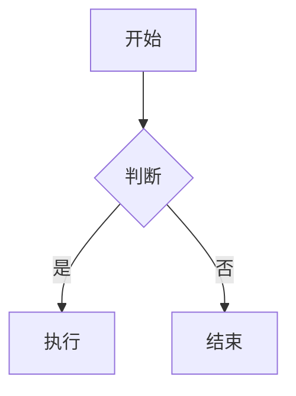
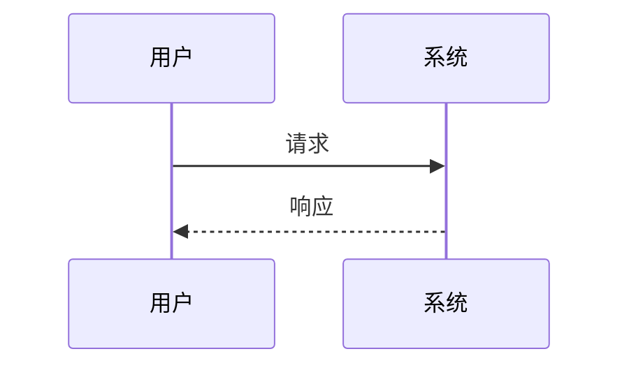
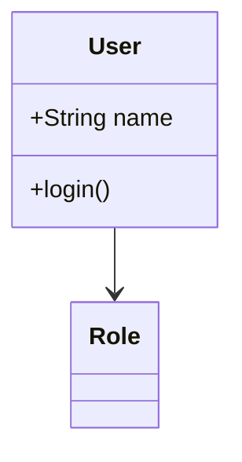
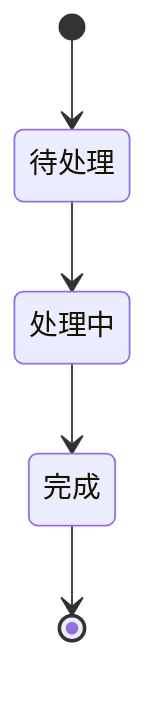
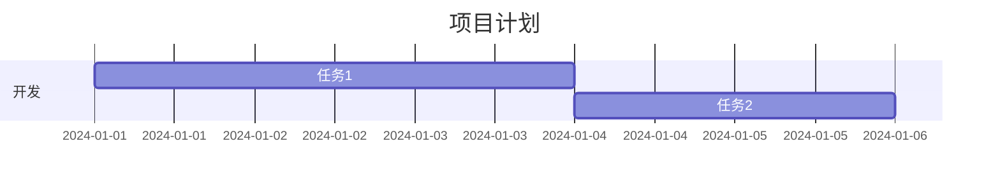
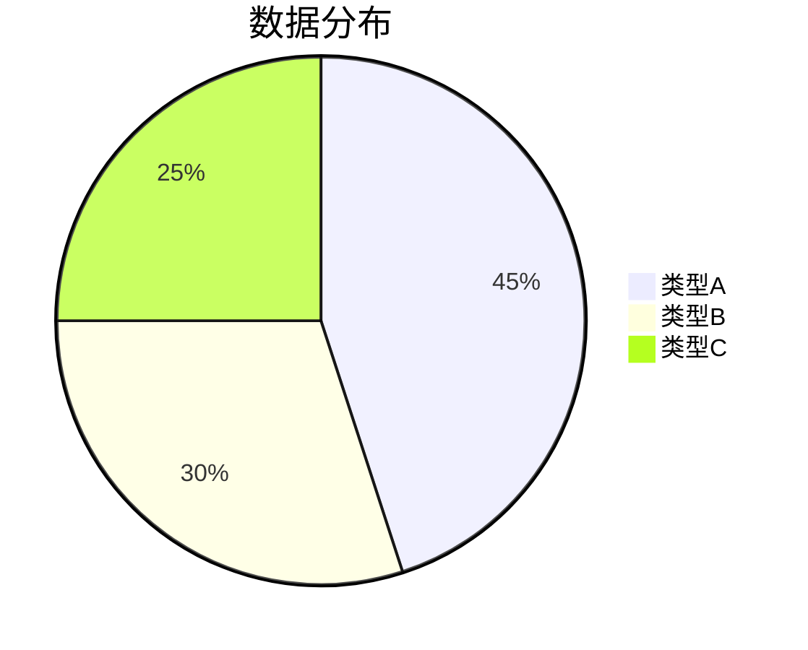

# Mermaid 图形和幻灯片格式帮助指南

## 概述

在笔记编辑界面的工具栏中，现在有一个"❓"帮助按钮，点击后可以查看完整的 Markdown 编辑帮助，包括新增的 Mermaid 图形格式和幻灯片格式扩展说明。

## 如何使用帮助功能

### 1. 打开帮助对话框
- 在笔记编辑界面，找到工具栏中的"❓"按钮
- 点击按钮即可打开 Markdown 格式指引对话框
- 在全屏编辑模式下也可以使用此功能

### 2. 浏览帮助内容
- 对话框支持垂直滚动，可以查看所有内容
- 内容按功能分组，便于查找
- 每个示例都有语法说明和效果预览

### 3. 复制示例代码
- 每个示例都有"复制"按钮
- 点击复制按钮后，代码会直接插入到当前笔记中
- 可以基于示例进行修改和定制

## Mermaid 图形格式

### 支持的图形类型

#### 1. 流程图 (Flowchart)


**用途**: 展示流程、决策树、算法步骤等

#### 2. 时序图 (Sequence Diagram)


**用途**: 展示系统交互、API 调用流程、用户操作序列等

#### 3. 类图 (Class Diagram)


**用途**: 展示面向对象设计、数据库关系、系统架构等

#### 4. 状态图 (State Diagram)


**用途**: 展示状态机、工作流状态、生命周期等

#### 5. 甘特图 (Gantt Chart)


**用途**: 项目管理、时间规划、任务安排等

#### 6. 饼图 (Pie Chart)


**用途**: 数据可视化、比例展示、统计分析等

## 幻灯片格式扩展

### 基本语法

#### 1. 幻灯片分隔符
```markdown
# 第一张幻灯片
内容...

---

# 第二张幻灯片
内容...

--slide

# 第三张幻灯片
内容...
```

**说明**: 
- 使用 `---` 或 `--slide` 分隔幻灯片
- 每张幻灯片可以包含任何 Markdown 内容

#### 2. 样式配置
```markdown
<!-- config: background=#1a1a1a text=#ffffff -->

# 深色主题幻灯片

这是一个使用深色背景的幻灯片
```

**说明**: 
- 使用配置注释设置背景色、文字色等
- 配置会应用到当前幻灯片

#### 3. CSS 样式块
```markdown
```css
.slide {
    background: linear-gradient(45deg, #667eea, #764ba2);
    color: white;
    font-size: 18px;
}
```

# 渐变背景幻灯片

使用自定义CSS样式
```

**说明**: 
- 可以使用 CSS 代码块定义自定义样式
- 样式会应用到后续的幻灯片

### 完整示例

```markdown
```css
.slide {
    background: #f8f9fa;
    padding: 40px;
}
```

# 演示标题

欢迎来到我的演示

---

<!-- config: background=#2c3e50 text=#ecf0f1 -->

# 深色主题页面

- 要点一
- 要点二  
- 要点三

--slide

# 总结

谢谢观看！
```

### 幻灯片功能特性

- **多种分隔符**: 支持 `---` 和 `--slide` 两种分隔符
- **样式模板**: 内置多种样式模板（默认、深色、蓝色等）
- **自定义样式**: 支持 CSS 样式和配置注释
- **播放模式**: 全屏播放和窗口播放两种模式
- **键盘导航**: 方向键、空格键、ESC键控制
- **自动检测**: 自动检测幻灯片格式并显示播放按钮

## 使用技巧

### 1. 快速开始
- 点击帮助按钮中的"复制"按钮获取示例代码
- 基于示例修改内容和样式
- 保存笔记后会自动检测幻灯片格式

### 2. 样式定制
- 使用配置注释快速设置颜色
- 使用 CSS 代码块进行高级样式定制
- 可以混合使用多种样式方法

### 3. 内容组织
- 每张幻灯片保持内容简洁
- 使用标题、列表、图片等丰富内容
- 可以在幻灯片中嵌入 Mermaid 图形

### 4. 演示技巧
- 使用全屏模式获得最佳演示效果
- 利用键盘快捷键流畅切换幻灯片
- 结合 Mermaid 图形增强视觉效果

## 总结

新增的 Mermaid 图形和幻灯片格式扩展大大增强了笔记的表达能力：

- **Mermaid 图形**: 支持 6 种主要图形类型，适用于各种场景
- **幻灯片格式**: 完整的幻灯片制作功能，支持样式定制
- **易于使用**: 通过帮助按钮快速获取示例和说明
- **功能完整**: 从基础语法到高级定制，满足各种需求

这些功能让笔记不仅可以记录文字，还能创建专业的图表和演示文稿，大大提升了笔记的实用性和表现力。
