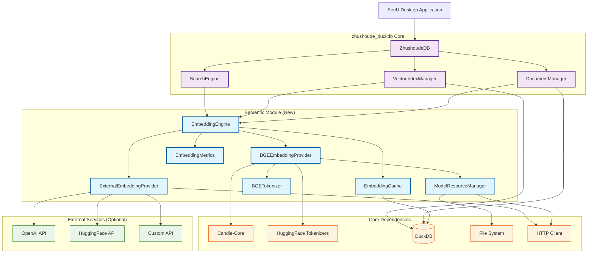
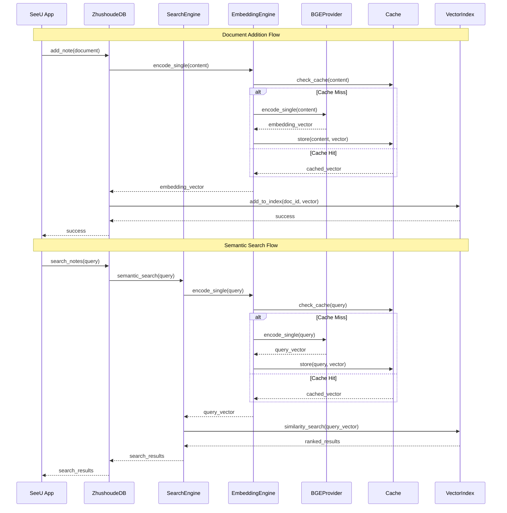
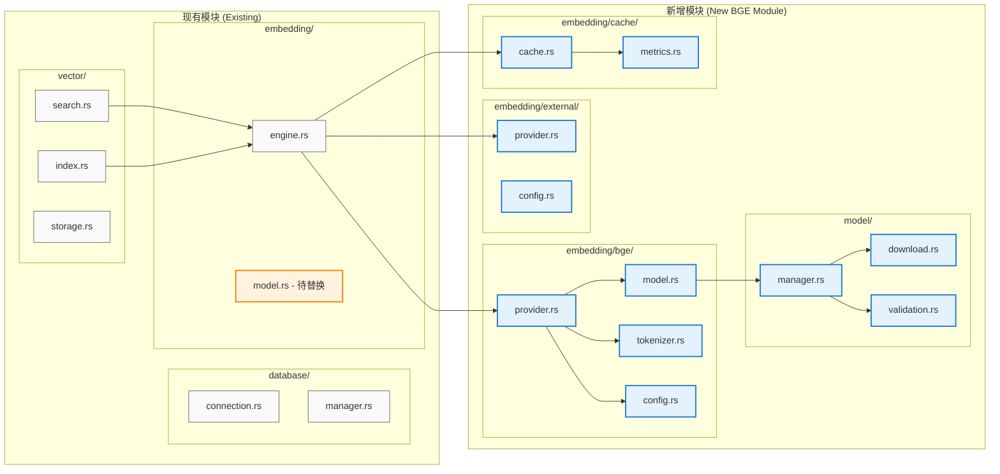
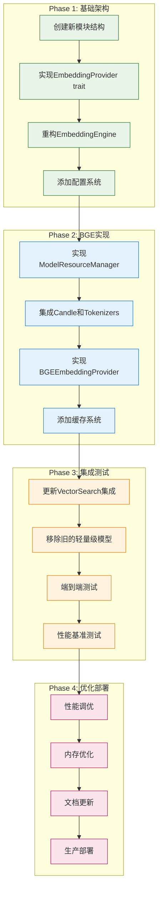
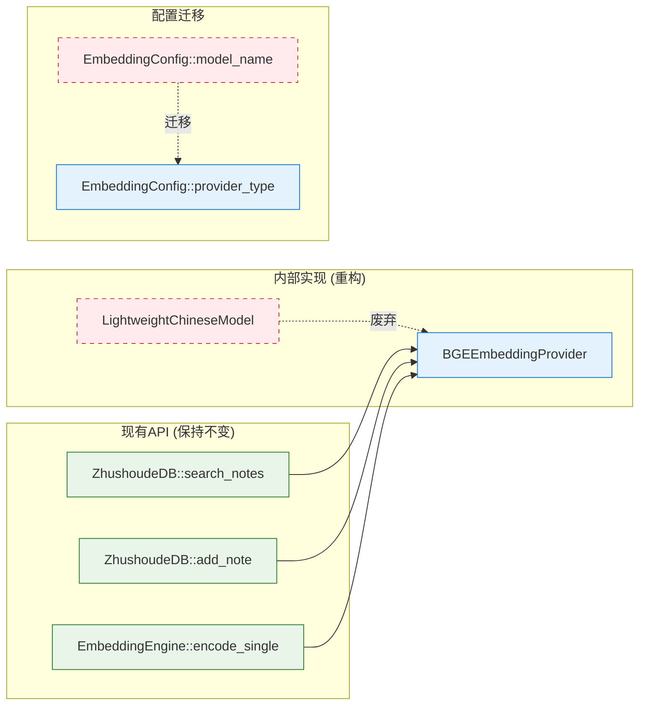

# BGE中文语义模型集成设计文档

## 📋 概述

本文档描述了在 `zhushoude_duckdb` 中集成BGE (BAAI General Embedding) 中文语义模型的详细设计方案。目标是提供高质量的中文语义搜索能力，同时保持轻量级和高性能。

## 🎯 设计目标

- **高质量语义理解**: 使用BGE模型提供准确的中文语义向量
- **轻量级部署**: 控制资源占用，适合桌面应用
- **纯Rust实现**: 无Python依赖，简化部署
- **扩展性**: 支持多种模型和外部服务
- **高性能**: 优化推理速度和内存使用

## 🏗️ 技术架构

### 模块关系图



### 数据流图



### 核心技术栈

```toml
[dependencies]
# 模型推理引擎
candle-core = "0.3"
candle-nn = "0.3"
candle-transformers = "0.3"

# 分词器
tokenizers = "0.15"

# 网络和异步
reqwest = { version = "0.11", features = ["json", "stream"] }
tokio = { version = "1.0", features = ["full"] }

# 数值计算
ndarray = "0.15"

# 缓存
moka = { version = "0.12", features = ["future"] }

# 序列化和配置
serde = { version = "1.0", features = ["derive"] }
serde_json = "1.0"

# 文件处理
flate2 = "1.0"
tar = "0.4"
sha2 = "0.10"

# 错误处理和日志
anyhow = "1.0"
thiserror = "1.0"
tracing = "0.1"
```

### 模块集成架构



### 文件结构变更

```
crates/zhushoude_duckdb/src/
├── database/
│   ├── connection.rs          # 现有 - 需要移除硬编码相似度
│   └── manager.rs             # 现有 - 保持不变
├── vector/
│   ├── index.rs               # 现有 - 保持不变
│   ├── search.rs              # 现有 - 集成新的嵌入引擎
│   └── storage.rs             # 现有 - 保持不变
├── embedding/
│   ├── engine.rs              # 现有 - 重构为提供者管理器
│   ├── model.rs               # 现有 - 标记为废弃，逐步移除
│   ├── bge/                   # 新增 - BGE模型实现
│   │   ├── mod.rs
│   │   ├── provider.rs        # BGE嵌入提供者
│   │   ├── model.rs           # BGE模型封装
│   │   ├── tokenizer.rs       # BGE分词器
│   │   └── config.rs          # BGE配置
│   ├── external/              # 新增 - 外部服务支持
│   │   ├── mod.rs
│   │   ├── provider.rs        # 外部API提供者
│   │   └── config.rs          # 外部服务配置
│   └── cache/                 # 新增 - 缓存系统
│       ├── mod.rs
│       ├── cache.rs           # 嵌入缓存实现
│       └── metrics.rs         # 性能指标
├── model/                     # 新增 - 模型管理
│   ├── mod.rs
│   ├── manager.rs             # 模型资源管理器
│   ├── download.rs            # 模型下载器
│   └── validation.rs          # 模型验证
└── lib.rs                     # 更新导出
```

## 📦 模块设计

### 1. 嵌入提供者抽象层

```rust
/// 嵌入提供者统一接口
pub trait EmbeddingProvider: Send + Sync {
    /// 单文本编码
    async fn encode_single(&self, text: &str) -> Result<Vec<f32>>;

    /// 批量文本编码
    async fn encode_batch(&self, texts: &[&str]) -> Result<Vec<Vec<f32>>>;

    /// 获取向量维度
    fn get_dimension(&self) -> usize;

    /// 获取模型信息
    fn get_model_info(&self) -> ModelInfo;

    /// 健康检查
    async fn health_check(&self) -> Result<()>;
}

/// 模型信息
#[derive(Debug, Clone, Serialize, Deserialize)]
pub struct ModelInfo {
    pub name: String,
    pub version: String,
    pub dimension: usize,
    pub max_sequence_length: usize,
    pub language: String,
    pub model_type: ModelType,
    pub memory_usage: usize,
}

/// 模型类型
#[derive(Debug, Clone, Serialize, Deserialize)]
pub enum ModelType {
    BGE,
    External,
    Custom,
}
```

### 2. BGE模型配置

```rust
/// BGE模型配置
#[derive(Debug, Clone, Serialize, Deserialize)]
pub struct BGEConfig {
    /// 模型变体
    pub model_variant: BGEVariant,
    /// 计算设备
    pub device: Device,
    /// 批处理大小
    pub batch_size: usize,
    /// 最大序列长度
    pub max_length: usize,
    /// 是否归一化向量
    pub normalize_embeddings: bool,
    /// 缓存大小
    pub cache_size: usize,
    /// 是否启用量化
    pub enable_quantization: bool,
    /// 模型缓存目录
    pub cache_dir: PathBuf,
}

/// BGE模型变体
#[derive(Debug, Clone, Serialize, Deserialize)]
pub enum BGEVariant {
    /// bge-small-zh-v1.5 (33M参数, 512维)
    Small,
    /// bge-base-zh-v1.5 (102M参数, 768维)
    Base,
    /// bge-large-zh-v1.5 (326M参数, 1024维)
    Large,
}

/// 计算设备
#[derive(Debug, Clone, Serialize, Deserialize)]
pub enum Device {
    CPU,
    CUDA(usize),
    Metal,
}

impl Default for BGEConfig {
    fn default() -> Self {
        Self {
            model_variant: BGEVariant::Small,
            device: Device::CPU,
            batch_size: 32,
            max_length: 512,
            normalize_embeddings: true,
            cache_size: 10000,
            enable_quantization: true,
            cache_dir: PathBuf::from("./models/bge"),
        }
    }
}
```

### 3. BGE模型实现

```rust
/// BGE嵌入提供者
pub struct BGEEmbeddingProvider {
    model: BGEModel,
    tokenizer: BGETokenizer,
    config: BGEConfig,
    cache: moka::future::Cache<String, Vec<f32>>,
    metrics: Arc<EmbeddingMetrics>,
}

/// BGE模型封装
pub struct BGEModel {
    model: candle_transformers::models::bert::BertModel,
    device: candle_core::Device,
    config: BGEConfig,
}

/// BGE分词器封装
pub struct BGETokenizer {
    tokenizer: tokenizers::Tokenizer,
    max_length: usize,
    pad_token_id: u32,
    cls_token_id: u32,
    sep_token_id: u32,
}

impl BGEEmbeddingProvider {
    /// 创建新的BGE提供者
    pub async fn new(config: BGEConfig) -> Result<Self> {
        let model = BGEModel::load(&config).await?;
        let tokenizer = BGETokenizer::load(&config).await?;

        let cache = moka::future::Cache::builder()
            .max_capacity(config.cache_size as u64)
            .time_to_live(Duration::from_secs(3600))
            .build();

        Ok(Self {
            model,
            tokenizer,
            config,
            cache,
            metrics: Arc::new(EmbeddingMetrics::new()),
        })
    }

    /// 预处理文本
    fn preprocess_text(&self, text: &str) -> String {
        // 1. 文本清理：移除多余空白字符
        let cleaned = text.trim().chars()
            .map(|c| if c.is_whitespace() { ' ' } else { c })
            .collect::<String>();

        // 2. 长度检查和截断
        if cleaned.chars().count() > self.config.max_length - 2 {
            cleaned.chars().take(self.config.max_length - 2).collect()
        } else {
            cleaned
        }
    }

    /// 后处理向量
    fn postprocess_embedding(&self, embedding: Vec<f32>) -> Vec<f32> {
        if self.config.normalize_embeddings {
            self.normalize_vector(embedding)
        } else {
            embedding
        }
    }

    /// L2归一化
    fn normalize_vector(&self, mut vector: Vec<f32>) -> Vec<f32> {
        let norm: f32 = vector.iter().map(|x| x * x).sum::<f32>().sqrt();
        if norm > 0.0 {
            for v in &mut vector {
                *v /= norm;
            }
        }
        vector
    }
}

impl EmbeddingProvider for BGEEmbeddingProvider {
    async fn encode_single(&self, text: &str) -> Result<Vec<f32>> {
        let start_time = std::time::Instant::now();

        // 检查缓存
        let cache_key = format!("{}:{}", self.config.model_variant.to_string(), text);
        if let Some(cached) = self.cache.get(&cache_key).await {
            self.metrics.record_cache_hit();
            return Ok(cached);
        }

        // 预处理文本
        let processed_text = self.preprocess_text(text);

        // 分词
        let tokens = self.tokenizer.encode(&processed_text)?;

        // 模型推理
        let embedding = self.model.forward(&tokens).await?;

        // 后处理
        let final_embedding = self.postprocess_embedding(embedding);

        // 缓存结果
        self.cache.insert(cache_key, final_embedding.clone()).await;

        // 记录指标
        self.metrics.record_request(start_time.elapsed(), false);

        Ok(final_embedding)
    }

    async fn encode_batch(&self, texts: &[&str]) -> Result<Vec<Vec<f32>>> {
        if texts.is_empty() {
            return Ok(Vec::new());
        }

        // 检查缓存
        let mut results = Vec::with_capacity(texts.len());
        let mut uncached_indices = Vec::new();
        let mut uncached_texts = Vec::new();

        for (i, text) in texts.iter().enumerate() {
            let cache_key = format!("{}:{}", self.config.model_variant.to_string(), text);
            if let Some(cached) = self.cache.get(&cache_key).await {
                results.push((i, cached));
                self.metrics.record_cache_hit();
            } else {
                uncached_indices.push(i);
                uncached_texts.push(*text);
            }
        }

        // 批量处理未缓存的文本
        if !uncached_texts.is_empty() {
            let batch_embeddings = self.batch_inference(&uncached_texts).await?;

            for (idx, embedding) in uncached_indices.into_iter().zip(batch_embeddings) {
                let cache_key = format!("{}:{}", self.config.model_variant.to_string(), texts[idx]);
                self.cache.insert(cache_key, embedding.clone()).await;
                results.push((idx, embedding));
            }
        }

        // 按原始顺序排序
        results.sort_by_key(|(idx, _)| *idx);
        Ok(results.into_iter().map(|(_, embedding)| embedding).collect())
    }

    fn get_dimension(&self) -> usize {
        match self.config.model_variant {
            BGEVariant::Small => 512,
            BGEVariant::Base => 768,
            BGEVariant::Large => 1024,
        }
    }

    fn get_model_info(&self) -> ModelInfo {
        ModelInfo {
            name: format!("bge-{}-zh-v1.5", self.config.model_variant.to_string().to_lowercase()),
            version: "1.5".to_string(),
            dimension: self.get_dimension(),
            max_sequence_length: self.config.max_length,
            language: "zh".to_string(),
            model_type: ModelType::BGE,
            memory_usage: self.estimate_memory_usage(),
        }
    }

    async fn health_check(&self) -> Result<()> {
        // 使用简单文本测试模型
        let test_text = "测试";
        let _embedding = self.encode_single(test_text).await?;
        Ok(())
    }
}

### 4. 模型加载和管理

```rust
/// 模型资源管理器
pub struct ModelResourceManager {
    cache_dir: PathBuf,
    http_client: reqwest::Client,
    download_progress: Arc<Mutex<HashMap<String, DownloadProgress>>>,
}

/// 下载进度
#[derive(Debug, Clone)]
pub struct DownloadProgress {
    pub total_bytes: u64,
    pub downloaded_bytes: u64,
    pub status: DownloadStatus,
}

#[derive(Debug, Clone)]
pub enum DownloadStatus {
    Pending,
    Downloading,
    Completed,
    Failed(String),
}

impl ModelResourceManager {
    pub fn new(cache_dir: PathBuf) -> Self {
        Self {
            cache_dir,
            http_client: reqwest::Client::new(),
            download_progress: Arc::new(Mutex::new(HashMap::new())),
        }
    }

    /// 确保模型可用
    pub async fn ensure_model_available(&self, variant: BGEVariant) -> Result<ModelPaths> {
        let model_paths = self.get_model_paths(&variant);

        // 检查模型文件是否存在
        if !self.validate_model_files(&model_paths).await? {
            self.download_model(&variant).await?;
        }

        Ok(model_paths)
    }

    /// 下载模型
    async fn download_model(&self, variant: &BGEVariant) -> Result<()> {
        let model_info = self.get_model_download_info(variant);

        // 创建缓存目录
        tokio::fs::create_dir_all(&self.cache_dir).await?;

        // 下载模型文件
        for file_info in &model_info.files {
            self.download_file(file_info).await?;
        }

        // 验证下载完整性
        self.verify_model_integrity(&model_info).await?;

        Ok(())
    }

    /// 下载单个文件
    async fn download_file(&self, file_info: &FileInfo) -> Result<()> {
        let file_path = self.cache_dir.join(&file_info.filename);

        // 检查是否已存在且校验和正确
        if file_path.exists() {
            if let Ok(checksum) = self.calculate_file_checksum(&file_path).await {
                if checksum == file_info.sha256 {
                    return Ok(());
                }
            }
        }

        // 下载文件
        let response = self.http_client.get(&file_info.url).send().await?;
        let total_size = response.content_length().unwrap_or(0);

        // 更新下载进度
        self.update_download_progress(&file_info.filename, total_size, 0).await;

        let mut file = tokio::fs::File::create(&file_path).await?;
        let mut downloaded = 0u64;
        let mut stream = response.bytes_stream();

        while let Some(chunk) = stream.next().await {
            let chunk = chunk?;
            file.write_all(&chunk).await?;
            downloaded += chunk.len() as u64;

            // 更新进度
            self.update_download_progress(&file_info.filename, total_size, downloaded).await;
        }

        // 验证校验和
        let checksum = self.calculate_file_checksum(&file_path).await?;
        if checksum != file_info.sha256 {
            return Err(anyhow::anyhow!("文件校验和不匹配: {}", file_info.filename));
        }

        Ok(())
    }
}

/// 模型文件路径
#[derive(Debug, Clone)]
pub struct ModelPaths {
    pub model_file: PathBuf,
    pub tokenizer_file: PathBuf,
    pub config_file: PathBuf,
}

/// 文件信息
#[derive(Debug, Clone)]
pub struct FileInfo {
    pub filename: String,
    pub url: String,
    pub sha256: String,
    pub size: u64,
}

/// 模型下载信息
#[derive(Debug, Clone)]
pub struct ModelDownloadInfo {
    pub variant: BGEVariant,
    pub files: Vec<FileInfo>,
}
```

### 5. 分词器实现

```rust
impl BGETokenizer {
    /// 加载分词器
    pub async fn load(config: &BGEConfig) -> Result<Self> {
        let tokenizer_path = config.cache_dir.join("tokenizer.json");

        let tokenizer = tokenizers::Tokenizer::from_file(&tokenizer_path)
            .map_err(|e| anyhow::anyhow!("加载分词器失败: {}", e))?;

        // 获取特殊token ID
        let pad_token_id = tokenizer.token_to_id("[PAD]").unwrap_or(0);
        let cls_token_id = tokenizer.token_to_id("[CLS]").unwrap_or(101);
        let sep_token_id = tokenizer.token_to_id("[SEP]").unwrap_or(102);

        Ok(Self {
            tokenizer,
            max_length: config.max_length,
            pad_token_id,
            cls_token_id,
            sep_token_id,
        })
    }

    /// 编码文本
    pub fn encode(&self, text: &str) -> Result<TokenizedInput> {
        let encoding = self.tokenizer.encode(text, false)
            .map_err(|e| anyhow::anyhow!("分词失败: {}", e))?;

        let mut input_ids = vec![self.cls_token_id];
        input_ids.extend_from_slice(encoding.get_ids());

        // 截断到最大长度-1，为SEP token留空间
        if input_ids.len() >= self.max_length {
            input_ids.truncate(self.max_length - 1);
        }

        input_ids.push(self.sep_token_id);

        // 创建attention mask
        let attention_mask = vec![1u32; input_ids.len()];

        // 填充到最大长度
        let padding_length = self.max_length - input_ids.len();
        input_ids.extend(vec![self.pad_token_id; padding_length]);
        let mut attention_mask_padded = attention_mask;
        attention_mask_padded.extend(vec![0u32; padding_length]);

        Ok(TokenizedInput {
            input_ids,
            attention_mask: attention_mask_padded,
            sequence_length: input_ids.len(),
        })
    }
}

/// 分词结果
#[derive(Debug, Clone)]
pub struct TokenizedInput {
    pub input_ids: Vec<u32>,
    pub attention_mask: Vec<u32>,
    pub sequence_length: usize,
}

### 6. 模型推理实现

```rust
impl BGEModel {
    /// 加载模型
    pub async fn load(config: &BGEConfig) -> Result<Self> {
        let model_paths = ModelResourceManager::new(config.cache_dir.clone())
            .ensure_model_available(config.model_variant.clone()).await?;

        // 创建设备
        let device = match &config.device {
            Device::CPU => candle_core::Device::Cpu,
            Device::CUDA(id) => candle_core::Device::Cuda(*id),
            Device::Metal => candle_core::Device::Metal(0),
        };

        // 加载模型权重
        let model = if config.enable_quantization {
            Self::load_quantized_model(&model_paths.model_file, &device)?
        } else {
            Self::load_full_precision_model(&model_paths.model_file, &device)?
        };

        Ok(Self {
            model,
            device,
            config: config.clone(),
        })
    }

    /// 前向推理
    pub async fn forward(&self, tokens: &TokenizedInput) -> Result<Vec<f32>> {
        // 转换为Tensor
        let input_ids = Tensor::new(&tokens.input_ids, &self.device)?;
        let attention_mask = Tensor::new(&tokens.attention_mask, &self.device)?;

        // 模型前向传播
        let outputs = self.model.forward(&input_ids, &attention_mask)?;

        // 平均池化
        let pooled_output = self.mean_pooling(&outputs, &attention_mask)?;

        // 转换为Vec<f32>
        let embedding = pooled_output.to_vec1::<f32>()?;

        Ok(embedding)
    }

    /// 平均池化
    fn mean_pooling(&self, token_embeddings: &Tensor, attention_mask: &Tensor) -> Result<Tensor> {
        // 扩展attention_mask维度以匹配token_embeddings
        let expanded_mask = attention_mask.unsqueeze(2)?
            .expand(token_embeddings.shape())?;

        // 应用mask
        let masked_embeddings = token_embeddings.mul(&expanded_mask)?;

        // 计算有效token数量
        let sum_mask = attention_mask.sum_keepdim(1)?;

        // 求和并除以有效token数量
        let sum_embeddings = masked_embeddings.sum_keepdim(1)?;
        let mean_embeddings = sum_embeddings.div(&sum_mask.unsqueeze(2)?)?;

        // 移除多余维度
        mean_embeddings.squeeze(1)
    }

    /// 批量推理
    pub async fn batch_forward(&self, batch_tokens: &[TokenizedInput]) -> Result<Vec<Vec<f32>>> {
        if batch_tokens.is_empty() {
            return Ok(Vec::new());
        }

        // 构建批量输入
        let batch_size = batch_tokens.len();
        let seq_len = batch_tokens[0].input_ids.len();

        let mut batch_input_ids = Vec::with_capacity(batch_size * seq_len);
        let mut batch_attention_mask = Vec::with_capacity(batch_size * seq_len);

        for tokens in batch_tokens {
            batch_input_ids.extend_from_slice(&tokens.input_ids);
            batch_attention_mask.extend_from_slice(&tokens.attention_mask);
        }

        // 创建批量Tensor
        let input_ids = Tensor::new(&batch_input_ids, &self.device)?
            .reshape(&[batch_size, seq_len])?;
        let attention_mask = Tensor::new(&batch_attention_mask, &self.device)?
            .reshape(&[batch_size, seq_len])?;

        // 批量前向传播
        let outputs = self.model.forward(&input_ids, &attention_mask)?;

        // 批量池化
        let pooled_outputs = self.batch_mean_pooling(&outputs, &attention_mask)?;

        // 转换为Vec<Vec<f32>>
        let embeddings = pooled_outputs.to_vec2::<f32>()?;

        Ok(embeddings)
    }
}

### 7. 性能优化

```rust
/// 性能监控指标
#[derive(Debug, Default)]
pub struct EmbeddingMetrics {
    pub total_requests: AtomicU64,
    pub cache_hits: AtomicU64,
    pub cache_misses: AtomicU64,
    pub total_latency_ms: AtomicU64,
    pub error_count: AtomicU64,
    pub memory_usage_bytes: AtomicU64,
}

impl EmbeddingMetrics {
    pub fn new() -> Self {
        Self::default()
    }

    pub fn record_request(&self, latency: Duration, cache_hit: bool) {
        self.total_requests.fetch_add(1, Ordering::Relaxed);
        self.total_latency_ms.fetch_add(latency.as_millis() as u64, Ordering::Relaxed);

        if cache_hit {
            self.cache_hits.fetch_add(1, Ordering::Relaxed);
        } else {
            self.cache_misses.fetch_add(1, Ordering::Relaxed);
        }
    }

    pub fn record_cache_hit(&self) {
        self.cache_hits.fetch_add(1, Ordering::Relaxed);
    }

    pub fn record_error(&self) {
        self.error_count.fetch_add(1, Ordering::Relaxed);
    }

    pub fn get_stats(&self) -> EmbeddingStats {
        let total_requests = self.total_requests.load(Ordering::Relaxed);
        let cache_hits = self.cache_hits.load(Ordering::Relaxed);
        let total_latency = self.total_latency_ms.load(Ordering::Relaxed);

        EmbeddingStats {
            total_requests,
            cache_hit_rate: if total_requests > 0 {
                cache_hits as f64 / total_requests as f64
            } else {
                0.0
            },
            average_latency_ms: if total_requests > 0 {
                total_latency as f64 / total_requests as f64
            } else {
                0.0
            },
            error_count: self.error_count.load(Ordering::Relaxed),
            memory_usage_mb: self.memory_usage_bytes.load(Ordering::Relaxed) as f64 / 1024.0 / 1024.0,
        }
    }
}

/// 性能统计
#[derive(Debug, Clone, Serialize, Deserialize)]
pub struct EmbeddingStats {
    pub total_requests: u64,
    pub cache_hit_rate: f64,
    pub average_latency_ms: f64,
    pub error_count: u64,
    pub memory_usage_mb: f64,
}

### 迁移策略



### 向后兼容性



## 🚀 实施计划

### Phase 1: 基础架构 (Week 1-2)
- [ ] 实现嵌入提供者抽象层
- [ ] 创建BGE配置和基础结构
- [ ] 实现模型下载管理器
- [ ] 添加基础错误处理和日志

### Phase 2: 核心功能 (Week 3-4)
- [ ] 实现BGE分词器集成
- [ ] 实现Candle模型加载和推理
- [ ] 添加缓存机制
- [ ] 实现批处理优化

### Phase 3: 性能优化 (Week 5-6)
- [ ] 添加量化支持
- [ ] 实现内存池和SIMD优化
- [ ] 添加GPU支持
- [ ] 性能基准测试

### Phase 4: 集成测试 (Week 7-8)
- [ ] 集成到zhushoude_duckdb
- [ ] 端到端测试
- [ ] 性能调优
- [ ] 文档完善

## 📊 资源占用预估

### BGE-Small-ZH-v1.5
- **模型文件大小**: ~130MB
- **量化后大小**: ~35MB
- **运行时内存**: ~200MB
- **推理延迟**:
  - CPU: ~10ms/句
  - GPU: ~2ms/句

### 依赖库大小
- **Candle**: ~15MB
- **Tokenizers**: ~8MB
- **其他依赖**: ~5MB
- **总计**: ~160MB (含模型)

## 🔧 配置示例

### 默认配置
```rust
let config = BGEConfig::default(); // 使用BGE-Small, CPU推理
```

### 高性能配置
```rust
let config = BGEConfig {
    model_variant: BGEVariant::Base,
    device: Device::CUDA(0),
    batch_size: 64,
    enable_quantization: false,
    cache_size: 50000,
    ..Default::default()
};
```

### 低资源配置
```rust
let config = BGEConfig {
    model_variant: BGEVariant::Small,
    device: Device::CPU,
    batch_size: 16,
    enable_quantization: true,
    cache_size: 5000,
    max_length: 256,
    ..Default::default()
};
```

## 🧪 测试策略

### 单元测试
- 分词器功能测试
- 模型加载测试
- 向量计算准确性测试
- 缓存机制测试

### 集成测试
- 端到端语义搜索测试
- 性能基准测试
- 内存泄漏测试
- 并发安全测试

### 质量保证
- 语义相似度准确性验证
- 与Python BGE实现对比
- 多语言文本处理测试
- 边界条件测试

## 📈 监控和维护

### 运行时监控
- 推理延迟监控
- 内存使用监控
- 缓存命中率监控
- 错误率监控

### 日志记录
- 模型加载日志
- 推理性能日志
- 错误和异常日志
- 资源使用日志

### 维护计划
- 定期性能评估
- 模型版本更新
- 依赖库更新
- 安全漏洞修复

## 🔗 与现有系统集成

### 数据库集成
```rust
// 在 database/connection.rs 中移除硬编码相似度计算
impl DatabaseConnection {
    // 移除这个硬编码的相似度计算
    // fn calculate_similarity(&self, text1: &str, text2: &str) -> f64 { 0.8 }

    // 新的集成方式
    pub async fn search_with_semantic(
        &self,
        query: &str,
        embedding_engine: &EmbeddingEngine,
        limit: usize,
    ) -> Result<Vec<SearchResult>> {
        // 1. 获取查询向量
        let query_vector = embedding_engine.encode_single(query).await?;

        // 2. 使用DuckDB向量搜索
        let sql = r#"
            SELECT id, title, content,
                   array_cosine_similarity(embedding, $1::FLOAT[]) as similarity
            FROM notes
            WHERE embedding IS NOT NULL
            ORDER BY similarity DESC
            LIMIT $2
        "#;

        let results = self.query(sql, &[&query_vector, &limit]).await?;
        Ok(results)
    }
}
```

### 向量索引集成
```rust
// 在 vector/index.rs 中集成新的嵌入引擎
impl VectorIndexManager {
    pub async fn rebuild_with_bge(&mut self, embedding_engine: &EmbeddingEngine) -> Result<()> {
        // 1. 获取所有文档
        let documents = self.get_all_documents().await?;

        // 2. 批量重新向量化
        let texts: Vec<&str> = documents.iter().map(|d| d.content.as_str()).collect();
        let embeddings = embedding_engine.encode_batch(&texts).await?;

        // 3. 更新向量索引
        for (doc, embedding) in documents.iter().zip(embeddings.iter()) {
            self.update_embedding(doc.id, embedding.clone()).await?;
        }

        // 4. 重建索引
        self.rebuild_index().await?;

        Ok(())
    }

    pub async fn add_document_with_embedding(
        &mut self,
        doc_id: i64,
        content: &str,
        embedding_engine: &EmbeddingEngine,
    ) -> Result<()> {
        // 1. 生成向量
        let embedding = embedding_engine.encode_single(content).await?;

        // 2. 存储到数据库
        self.store_embedding(doc_id, embedding).await?;

        // 3. 更新索引
        self.update_index(doc_id).await?;

        Ok(())
    }
}
```

### 搜索引擎集成
```rust
// 在 vector/search.rs 中集成语义搜索
impl VectorSearchEngine {
    pub async fn semantic_search(
        &self,
        query: &str,
        embedding_engine: &EmbeddingEngine,
        options: SearchOptions,
    ) -> Result<Vec<SearchResult>> {
        // 1. 编码查询
        let query_embedding = embedding_engine.encode_single(query).await?;

        // 2. 向量相似度搜索
        let vector_results = self.similarity_search(
            &query_embedding,
            options.limit * 2, // 获取更多候选
        ).await?;

        // 3. 混合排序 (可选)
        let final_results = if options.enable_hybrid {
            self.hybrid_ranking(query, vector_results, options).await?
        } else {
            vector_results
        };

        // 4. 应用过滤和排序
        Ok(self.apply_filters(final_results, options).await?)
    }

    async fn hybrid_ranking(
        &self,
        query: &str,
        vector_results: Vec<SearchResult>,
        options: SearchOptions,
    ) -> Result<Vec<SearchResult>> {
        // 结合传统关键词搜索和语义搜索
        let keyword_results = self.keyword_search(query, options.limit).await?;

        // 使用RRF (Reciprocal Rank Fusion) 融合结果
        let fused_results = self.reciprocal_rank_fusion(
            vector_results,
            keyword_results,
            options.semantic_weight,
        );

        Ok(fused_results)
    }
}
```

### 配置管理集成
```rust
// 扩展现有配置系统
#[derive(Debug, Clone, Serialize, Deserialize)]
pub struct ZhushoudeConfig {
    pub database: DatabaseConfig,
    pub vector: VectorConfig,

    // 新增语义搜索配置
    pub semantic: SemanticConfig,
}

#[derive(Debug, Clone, Serialize, Deserialize)]
pub struct SemanticConfig {
    pub enabled: bool,
    pub provider: EmbeddingProviderConfig,
    pub cache: CacheConfig,
    pub performance: PerformanceConfig,
}

#[derive(Debug, Clone, Serialize, Deserialize)]
pub enum EmbeddingProviderConfig {
    BGE(BGEConfig),
    External(ExternalProviderConfig),
}

impl Default for SemanticConfig {
    fn default() -> Self {
        Self {
            enabled: true,
            provider: EmbeddingProviderConfig::BGE(BGEConfig::default()),
            cache: CacheConfig::default(),
            performance: PerformanceConfig::default(),
        }
    }
}
```
## 📦 数据迁移策略

### 现有数据迁移
```rust
/// 数据迁移管理器
pub struct DataMigrationManager {
    db: Arc<DatabaseConnection>,
    embedding_engine: Arc<EmbeddingEngine>,
    progress_callback: Option<Box<dyn Fn(MigrationProgress) + Send + Sync>>,
}

#[derive(Debug, Clone)]
pub struct MigrationProgress {
    pub total_documents: usize,
    pub processed_documents: usize,
    pub current_phase: MigrationPhase,
    pub estimated_remaining_time: Duration,
}

#[derive(Debug, Clone)]
pub enum MigrationPhase {
    Analyzing,
    BackingUp,
    Migrating,
    Validating,
    Completed,
}

impl DataMigrationManager {
    /// 执行完整迁移
    pub async fn migrate_to_bge(&self) -> Result<MigrationReport> {
        let mut report = MigrationReport::new();

        // 1. 分析现有数据
        let analysis = self.analyze_existing_data().await?;
        report.analysis = Some(analysis.clone());

        // 2. 备份现有向量数据
        self.backup_existing_vectors().await?;

        // 3. 批量重新生成向量
        let migration_result = self.batch_regenerate_vectors(&analysis).await?;
        report.migration_result = Some(migration_result);

        // 4. 验证迁移结果
        let validation = self.validate_migration().await?;
        report.validation = Some(validation);

        // 5. 清理旧数据
        if validation.success {
            self.cleanup_old_vectors().await?;
        }

        Ok(report)
    }

    /// 分析现有数据
    async fn analyze_existing_data(&self) -> Result<DataAnalysis> {
        let sql = r#"
            SELECT
                COUNT(*) as total_notes,
                COUNT(embedding) as notes_with_embeddings,
                AVG(LENGTH(content)) as avg_content_length,
                MAX(LENGTH(content)) as max_content_length
            FROM notes
        "#;

        let stats = self.db.query_one(sql, &[]).await?;

        Ok(DataAnalysis {
            total_notes: stats.get("total_notes"),
            notes_with_embeddings: stats.get("notes_with_embeddings"),
            avg_content_length: stats.get("avg_content_length"),
            max_content_length: stats.get("max_content_length"),
            estimated_migration_time: self.estimate_migration_time(&stats),
        })
    }

    /// 批量重新生成向量
    async fn batch_regenerate_vectors(&self, analysis: &DataAnalysis) -> Result<MigrationResult> {
        let batch_size = self.calculate_optimal_batch_size(analysis);
        let mut processed = 0;
        let mut errors = Vec::new();

        let total_batches = (analysis.total_notes + batch_size - 1) / batch_size;

        for batch_idx in 0..total_batches {
            let offset = batch_idx * batch_size;

            match self.process_batch(offset, batch_size).await {
                Ok(batch_result) => {
                    processed += batch_result.processed_count;

                    // 更新进度
                    if let Some(callback) = &self.progress_callback {
                        callback(MigrationProgress {
                            total_documents: analysis.total_notes,
                            processed_documents: processed,
                            current_phase: MigrationPhase::Migrating,
                            estimated_remaining_time: self.estimate_remaining_time(
                                processed,
                                analysis.total_notes
                            ),
                        });
                    }
                }
                Err(e) => {
                    errors.push(MigrationError {
                        batch_index: batch_idx,
                        error: e.to_string(),
                    });
                }
            }
        }

        Ok(MigrationResult {
            total_processed: processed,
            total_errors: errors.len(),
            errors,
            duration: std::time::Instant::now().elapsed(),
        })
    }

    /// 处理单个批次
    async fn process_batch(&self, offset: usize, limit: usize) -> Result<BatchResult> {
        // 1. 获取批次数据
        let sql = r#"
            SELECT id, content
            FROM notes
            ORDER BY id
            LIMIT $1 OFFSET $2
        "#;

        let rows = self.db.query(sql, &[&limit, &offset]).await?;

        // 2. 提取文本内容
        let mut documents = Vec::new();
        for row in &rows {
            documents.push(Document {
                id: row.get("id"),
                content: row.get("content"),
            });
        }

        // 3. 批量生成向量
        let texts: Vec<&str> = documents.iter().map(|d| d.content.as_str()).collect();
        let embeddings = self.embedding_engine.encode_batch(&texts).await?;

        // 4. 批量更新数据库
        let mut processed_count = 0;
        for (doc, embedding) in documents.iter().zip(embeddings.iter()) {
            let update_sql = "UPDATE notes SET embedding = $1 WHERE id = $2";
            self.db.execute(update_sql, &[&embedding, &doc.id]).await?;
            processed_count += 1;
        }

        Ok(BatchResult {
            processed_count,
            batch_size: documents.len(),
        })
    }
}

#[derive(Debug)]
pub struct DataAnalysis {
    pub total_notes: usize,
    pub notes_with_embeddings: usize,
    pub avg_content_length: f64,
    pub max_content_length: usize,
    pub estimated_migration_time: Duration,
}

#[derive(Debug)]
pub struct MigrationResult {
    pub total_processed: usize,
    pub total_errors: usize,
    pub errors: Vec<MigrationError>,
    pub duration: Duration,
}

#[derive(Debug)]
pub struct MigrationError {
    pub batch_index: usize,
    pub error: String,
}
```

### 增量更新策略
```rust
/// 增量更新管理器
pub struct IncrementalUpdateManager {
    db: Arc<DatabaseConnection>,
    embedding_engine: Arc<EmbeddingEngine>,
    update_queue: Arc<Mutex<VecDeque<UpdateTask>>>,
}

#[derive(Debug, Clone)]
pub struct UpdateTask {
    pub document_id: i64,
    pub content: String,
    pub update_type: UpdateType,
    pub priority: Priority,
    pub created_at: DateTime<Utc>,
}

#[derive(Debug, Clone)]
pub enum UpdateType {
    Create,
    Update,
    Delete,
}

#[derive(Debug, Clone, PartialEq, Eq, PartialOrd, Ord)]
pub enum Priority {
    Low = 1,
    Normal = 2,
    High = 3,
    Critical = 4,
}

impl IncrementalUpdateManager {
    /// 添加更新任务
    pub async fn schedule_update(&self, task: UpdateTask) -> Result<()> {
        let mut queue = self.update_queue.lock().await;

        // 按优先级插入
        let insert_pos = queue.iter().position(|t| t.priority < task.priority)
            .unwrap_or(queue.len());

        queue.insert(insert_pos, task);
        Ok(())
    }

    /// 处理更新队列
    pub async fn process_updates(&self) -> Result<UpdateStats> {
        let mut stats = UpdateStats::default();
        let batch_size = 10; // 批量处理大小

        loop {
            let tasks = {
                let mut queue = self.update_queue.lock().await;
                let batch_end = std::cmp::min(batch_size, queue.len());
                if batch_end == 0 {
                    break;
                }
                queue.drain(0..batch_end).collect::<Vec<_>>()
            };

            match self.process_batch_updates(tasks).await {
                Ok(batch_stats) => {
                    stats.merge(batch_stats);
                }
                Err(e) => {
                    stats.errors += 1;
                    tracing::error!("批量更新失败: {}", e);
                }
            }
        }

        Ok(stats)
    }

    /// 处理批量更新
    async fn process_batch_updates(&self, tasks: Vec<UpdateTask>) -> Result<UpdateStats> {
        let mut stats = UpdateStats::default();

        // 按类型分组处理
        let (creates, updates, deletes): (Vec<_>, Vec<_>, Vec<_>) = tasks.into_iter()
            .fold((Vec::new(), Vec::new(), Vec::new()), |(mut c, mut u, mut d), task| {
                match task.update_type {
                    UpdateType::Create => c.push(task),
                    UpdateType::Update => u.push(task),
                    UpdateType::Delete => d.push(task),
                }
                (c, u, d)
            });

        // 处理创建
        if !creates.is_empty() {
            stats.created += self.process_creates(creates).await?;
        }

        // 处理更新
        if !updates.is_empty() {
            stats.updated += self.process_updates_batch(updates).await?;
        }

        // 处理删除
        if !deletes.is_empty() {
            stats.deleted += self.process_deletes(deletes).await?;
        }

        Ok(stats)
    }
}

#[derive(Debug, Default)]
pub struct UpdateStats {
    pub created: usize,
    pub updated: usize,
    pub deleted: usize,
    pub errors: usize,
}

impl UpdateStats {
    fn merge(&mut self, other: UpdateStats) {
        self.created += other.created;
        self.updated += other.updated;
        self.deleted += other.deleted;
        self.errors += other.errors;
    }
}
```
## 📊 中文语义功能评估与基准测试

### 评估框架概述

为确保BGE中文语义模块的正确性和性能，我们采用多层次的评估策略，包括标准基准测试、领域特定评估和实际应用场景测试。

### 标准基准测试

#### 1. C-MTEB (Chinese Massive Text Embedding Benchmark)

C-MTEB是最权威的中文文本嵌入评估基准，涵盖6大任务类型和35个数据集：

```rust
/// C-MTEB评估配置
#[derive(Debug, Clone)]
pub struct CMTEBConfig {
    pub tasks: Vec<CMTEBTask>,
    pub batch_size: usize,
    pub max_length: usize,
    pub normalize_embeddings: bool,
}

#[derive(Debug, Clone)]
pub enum CMTEBTask {
    /// 文本分类 (Text Classification)
    Classification(ClassificationDataset),
    /// 文本聚类 (Text Clustering)
    Clustering(ClusteringDataset),
    /// 文本对分类 (Pair Classification)
    PairClassification(PairClassificationDataset),
    /// 重排序 (Reranking)
    Reranking(RerankingDataset),
    /// 检索 (Retrieval)
    Retrieval(RetrievalDataset),
    /// 语义文本相似度 (Semantic Textual Similarity)
    STS(STSDataset),
}

#[derive(Debug, Clone)]
pub enum ClassificationDataset {
    TNews,           // 今日头条新闻分类
    IFlyTek,         // 科大讯飞长文本分类
    MultilingualSentiment, // 多语言情感分析
    JDReview,        // 京东商品评论情感分析
    OnlineShopping,  // 在线购物评论情感分析
    Waimai,          // 外卖评论情感分析
}

#[derive(Debug, Clone)]
pub enum STSDataset {
    AFQMC,           // 蚂蚁金融语义相似度
    LCQMC,           // 哈工大中文问题匹配
    PAWSX,           // 谷歌释义对抗数据集
    ChineseSTS,      // 中文语义文本相似度
    OPPO,            // OPPO小布对话匹配
    QQP,             // QQ问题对匹配
    CNSD,            // 中文自然语言推理
}

#[derive(Debug, Clone)]
pub enum RetrievalDataset {
    T2Retrieval,     // 文本检索
    MMarcoRetrieval, // 多语言Marco检索
    DuRetrieval,     // 百度检索
    CovidRetrieval,  // COVID相关检索
    CmedqaRetrieval, // 中文医疗问答检索
    EcomRetrieval,   // 电商检索
    MedicalRetrieval,// 医疗检索
    VideoRetrieval,  // 视频检索
}
```

#### 2. 语义相似度专项评估

```rust
/// 语义相似度评估器
pub struct SemanticSimilarityEvaluator {
    embedding_engine: Arc<EmbeddingEngine>,
    datasets: Vec<STSDataset>,
    metrics: Vec<SimilarityMetric>,
}

#[derive(Debug, Clone)]
pub enum SimilarityMetric {
    /// 皮尔逊相关系数
    PearsonCorrelation,
    /// 斯皮尔曼相关系数
    SpearmanCorrelation,
    /// 余弦相似度
    CosineSimilarity,
    /// 欧几里得距离
    EuclideanDistance,
    /// 曼哈顿距离
    ManhattanDistance,
}

impl SemanticSimilarityEvaluator {
    /// 运行完整评估
    pub async fn run_evaluation(&self) -> Result<EvaluationReport> {
        let mut results = Vec::new();

        for dataset in &self.datasets {
            let dataset_result = self.evaluate_dataset(dataset).await?;
            results.push(dataset_result);
        }

        Ok(EvaluationReport {
            overall_score: self.calculate_overall_score(&results),
            dataset_results: results,
            timestamp: Utc::now(),
        })
    }

    /// 评估单个数据集
    async fn evaluate_dataset(&self, dataset: &STSDataset) -> Result<DatasetResult> {
        let test_pairs = self.load_dataset(dataset).await?;
        let mut predictions = Vec::new();
        let mut ground_truth = Vec::new();

        // 批量处理测试对
        for batch in test_pairs.chunks(32) {
            let batch_predictions = self.process_batch(batch).await?;
            predictions.extend(batch_predictions);
            ground_truth.extend(batch.iter().map(|pair| pair.similarity_score));
        }

        // 计算各种指标
        let mut metric_scores = HashMap::new();
        for metric in &self.metrics {
            let score = self.calculate_metric(metric, &predictions, &ground_truth)?;
            metric_scores.insert(metric.clone(), score);
        }

        Ok(DatasetResult {
            dataset: dataset.clone(),
            metric_scores,
            sample_count: test_pairs.len(),
        })
    }

    /// 处理批量文本对
    async fn process_batch(&self, batch: &[TextPair]) -> Result<Vec<f64>> {
        let mut similarities = Vec::new();

        for pair in batch {
            // 获取两个文本的嵌入向量
            let embedding1 = self.embedding_engine.encode_single(&pair.text1).await?;
            let embedding2 = self.embedding_engine.encode_single(&pair.text2).await?;

            // 计算余弦相似度
            let similarity = self.cosine_similarity(&embedding1, &embedding2);
            similarities.push(similarity);
        }

        Ok(similarities)
    }

    /// 计算余弦相似度
    fn cosine_similarity(&self, vec1: &[f32], vec2: &[f32]) -> f64 {
        let dot_product: f32 = vec1.iter().zip(vec2.iter()).map(|(a, b)| a * b).sum();
        let norm1: f32 = vec1.iter().map(|x| x * x).sum::<f32>().sqrt();
        let norm2: f32 = vec2.iter().map(|x| x * x).sum::<f32>().sqrt();

        if norm1 == 0.0 || norm2 == 0.0 {
            0.0
        } else {
            (dot_product / (norm1 * norm2)) as f64
        }
    }
}

#[derive(Debug, Clone)]
pub struct TextPair {
    pub text1: String,
    pub text2: String,
    pub similarity_score: f64,
}

#[derive(Debug)]
pub struct EvaluationReport {
    pub overall_score: f64,
    pub dataset_results: Vec<DatasetResult>,
    pub timestamp: DateTime<Utc>,
}

#[derive(Debug)]
pub struct DatasetResult {
    pub dataset: STSDataset,
    pub metric_scores: HashMap<SimilarityMetric, f64>,
    pub sample_count: usize,
}
```

#### 3. 检索任务评估

```rust
/// 检索任务评估器
pub struct RetrievalEvaluator {
    embedding_engine: Arc<EmbeddingEngine>,
    vector_search: Arc<VectorSearchEngine>,
}

impl RetrievalEvaluator {
    /// 评估检索性能
    pub async fn evaluate_retrieval(&self, dataset: &RetrievalDataset) -> Result<RetrievalMetrics> {
        let queries = self.load_queries(dataset).await?;
        let corpus = self.load_corpus(dataset).await?;
        let relevance_judgments = self.load_relevance_judgments(dataset).await?;

        // 构建向量索引
        self.build_vector_index(&corpus).await?;

        let mut all_results = Vec::new();

        for query in &queries {
            // 执行检索
            let retrieved_docs = self.vector_search.search(
                &query.text,
                SearchOptions {
                    limit: 100,
                    threshold: 0.0,
                    ..Default::default()
                }
            ).await?;

            // 计算相关性指标
            let query_metrics = self.calculate_query_metrics(
                &query.id,
                &retrieved_docs,
                &relevance_judgments
            );

            all_results.push(query_metrics);
        }

        Ok(self.aggregate_metrics(all_results))
    }

    /// 计算单个查询的指标
    fn calculate_query_metrics(
        &self,
        query_id: &str,
        retrieved_docs: &[SearchResult],
        relevance_judgments: &HashMap<String, HashMap<String, i32>>
    ) -> QueryMetrics {
        let relevant_docs = relevance_judgments.get(query_id).unwrap_or(&HashMap::new());

        let mut precision_at_k = HashMap::new();
        let mut recall_at_k = HashMap::new();
        let mut ndcg_at_k = HashMap::new();

        for k in [1, 3, 5, 10, 20, 100] {
            let top_k = &retrieved_docs[..std::cmp::min(k, retrieved_docs.len())];

            // Precision@K
            let relevant_retrieved = top_k.iter()
                .filter(|doc| relevant_docs.get(&doc.id).unwrap_or(&0) > &0)
                .count();
            precision_at_k.insert(k, relevant_retrieved as f64 / k as f64);

            // Recall@K
            let total_relevant = relevant_docs.values().filter(|&&score| score > 0).count();
            if total_relevant > 0 {
                recall_at_k.insert(k, relevant_retrieved as f64 / total_relevant as f64);
            }

            // NDCG@K
            let ndcg = self.calculate_ndcg(top_k, relevant_docs, k);
            ndcg_at_k.insert(k, ndcg);
        }

        QueryMetrics {
            query_id: query_id.to_string(),
            precision_at_k,
            recall_at_k,
            ndcg_at_k,
            map: self.calculate_map(retrieved_docs, relevant_docs),
        }
    }

    /// 计算NDCG
    fn calculate_ndcg(
        &self,
        retrieved_docs: &[SearchResult],
        relevant_docs: &HashMap<String, i32>,
        k: usize
    ) -> f64 {
        let dcg = retrieved_docs.iter().take(k).enumerate()
            .map(|(i, doc)| {
                let relevance = *relevant_docs.get(&doc.id).unwrap_or(&0) as f64;
                relevance / (i as f64 + 2.0).log2()
            })
            .sum::<f64>();

        // 计算理想DCG
        let mut ideal_relevances: Vec<i32> = relevant_docs.values().cloned().collect();
        ideal_relevances.sort_by(|a, b| b.cmp(a));

        let idcg = ideal_relevances.iter().take(k).enumerate()
            .map(|(i, &relevance)| {
                relevance as f64 / (i as f64 + 2.0).log2()
            })
            .sum::<f64>();

        if idcg == 0.0 { 0.0 } else { dcg / idcg }
    }
}

#[derive(Debug)]
pub struct QueryMetrics {
    pub query_id: String,
    pub precision_at_k: HashMap<usize, f64>,
    pub recall_at_k: HashMap<usize, f64>,
    pub ndcg_at_k: HashMap<usize, f64>,
    pub map: f64,
}

#[derive(Debug)]
pub struct RetrievalMetrics {
    pub mean_precision_at_k: HashMap<usize, f64>,
    pub mean_recall_at_k: HashMap<usize, f64>,
    pub mean_ndcg_at_k: HashMap<usize, f64>,
    pub mean_average_precision: f64,
    pub query_count: usize,
}
```
### 领域特定评估

#### 1. 笔记语义搜索专项评估

```rust
/// 笔记语义搜索评估器
pub struct NoteSemanticEvaluator {
    embedding_engine: Arc<EmbeddingEngine>,
    test_notes: Vec<TestNote>,
    semantic_queries: Vec<SemanticQuery>,
}

#[derive(Debug, Clone)]
pub struct TestNote {
    pub id: String,
    pub title: String,
    pub content: String,
    pub tags: Vec<String>,
    pub category: NoteCategory,
}

#[derive(Debug, Clone)]
pub enum NoteCategory {
    Academic,      // 学术笔记
    Technical,     // 技术笔记
    Personal,      // 个人笔记
    Meeting,       // 会议记录
    Research,      // 研究笔记
    Literature,    // 文献笔记
}

#[derive(Debug, Clone)]
pub struct SemanticQuery {
    pub query_text: String,
    pub expected_results: Vec<String>, // 期望的笔记ID
    pub query_type: QueryType,
    pub difficulty: QueryDifficulty,
}

#[derive(Debug, Clone)]
pub enum QueryType {
    /// 概念查询：查找包含特定概念的笔记
    Conceptual(String),
    /// 主题查询：查找特定主题的笔记
    Topical(String),
    /// 关联查询：查找与给定内容相关的笔记
    Relational(String),
    /// 情境查询：基于使用场景的查询
    Contextual(String),
}

#[derive(Debug, Clone)]
pub enum QueryDifficulty {
    Easy,    // 直接关键词匹配
    Medium,  // 需要语义理解
    Hard,    // 需要深度推理
}

impl NoteSemanticEvaluator {
    /// 运行笔记语义搜索评估
    pub async fn evaluate_note_search(&self) -> Result<NoteSearchMetrics> {
        let mut query_results = Vec::new();

        for query in &self.semantic_queries {
            let search_results = self.embedding_engine
                .search_similar(&query.query_text, 20)
                .await?;

            let metrics = self.calculate_query_performance(query, &search_results);
            query_results.push(metrics);
        }

        Ok(self.aggregate_note_metrics(query_results))
    }

    /// 计算查询性能指标
    fn calculate_query_performance(
        &self,
        query: &SemanticQuery,
        results: &[SearchResult]
    ) -> QueryPerformance {
        let retrieved_ids: Vec<&str> = results.iter().map(|r| r.id.as_str()).collect();
        let expected_ids: Vec<&str> = query.expected_results.iter().map(|s| s.as_str()).collect();

        // 计算各种指标
        let precision = self.calculate_precision(&retrieved_ids, &expected_ids);
        let recall = self.calculate_recall(&retrieved_ids, &expected_ids);
        let f1_score = if precision + recall > 0.0 {
            2.0 * precision * recall / (precision + recall)
        } else {
            0.0
        };

        // 计算MRR (Mean Reciprocal Rank)
        let mrr = self.calculate_mrr(&retrieved_ids, &expected_ids);

        QueryPerformance {
            query_type: query.query_type.clone(),
            difficulty: query.difficulty.clone(),
            precision,
            recall,
            f1_score,
            mrr,
            retrieved_count: retrieved_ids.len(),
            expected_count: expected_ids.len(),
        }
    }

    /// 计算MRR
    fn calculate_mrr(&self, retrieved: &[&str], expected: &[&str]) -> f64 {
        for (i, &doc_id) in retrieved.iter().enumerate() {
            if expected.contains(&doc_id) {
                return 1.0 / (i + 1) as f64;
            }
        }
        0.0
    }
}

#[derive(Debug)]
pub struct QueryPerformance {
    pub query_type: QueryType,
    pub difficulty: QueryDifficulty,
    pub precision: f64,
    pub recall: f64,
    pub f1_score: f64,
    pub mrr: f64,
    pub retrieved_count: usize,
    pub expected_count: usize,
}

#[derive(Debug)]
pub struct NoteSearchMetrics {
    pub overall_precision: f64,
    pub overall_recall: f64,
    pub overall_f1: f64,
    pub overall_mrr: f64,
    pub metrics_by_type: HashMap<QueryType, f64>,
    pub metrics_by_difficulty: HashMap<QueryDifficulty, f64>,
    pub query_count: usize,
}
```

#### 2. 性能基准测试

```rust
/// 性能基准测试器
pub struct PerformanceBenchmark {
    embedding_engine: Arc<EmbeddingEngine>,
    test_configs: Vec<BenchmarkConfig>,
}

#[derive(Debug, Clone)]
pub struct BenchmarkConfig {
    pub name: String,
    pub text_lengths: Vec<usize>,      // 不同文本长度
    pub batch_sizes: Vec<usize>,       // 不同批处理大小
    pub concurrency_levels: Vec<usize>, // 不同并发级别
    pub iterations: usize,             // 测试迭代次数
}

impl PerformanceBenchmark {
    /// 运行性能基准测试
    pub async fn run_benchmark(&self) -> Result<BenchmarkReport> {
        let mut results = Vec::new();

        for config in &self.test_configs {
            let config_results = self.run_config_benchmark(config).await?;
            results.push(config_results);
        }

        Ok(BenchmarkReport {
            results,
            timestamp: Utc::now(),
            system_info: self.collect_system_info(),
        })
    }

    /// 运行单个配置的基准测试
    async fn run_config_benchmark(&self, config: &BenchmarkConfig) -> Result<ConfigBenchmarkResult> {
        let mut test_results = Vec::new();

        // 测试不同文本长度
        for &text_length in &config.text_lengths {
            let text = self.generate_test_text(text_length);

            // 测试不同批处理大小
            for &batch_size in &config.batch_sizes {
                let batch_texts = vec![text.as_str(); batch_size];

                // 测试不同并发级别
                for &concurrency in &config.concurrency_levels {
                    let result = self.run_performance_test(
                        &batch_texts,
                        concurrency,
                        config.iterations
                    ).await?;

                    test_results.push(PerformanceTestResult {
                        text_length,
                        batch_size,
                        concurrency,
                        latency_stats: result.latency_stats,
                        throughput: result.throughput,
                        memory_usage: result.memory_usage,
                        cpu_usage: result.cpu_usage,
                    });
                }
            }
        }

        Ok(ConfigBenchmarkResult {
            config_name: config.name.clone(),
            test_results,
        })
    }

    /// 运行性能测试
    async fn run_performance_test(
        &self,
        texts: &[&str],
        concurrency: usize,
        iterations: usize
    ) -> Result<TestMetrics> {
        let mut latencies = Vec::new();
        let start_time = Instant::now();
        let start_memory = self.get_memory_usage();

        // 并发执行测试
        let semaphore = Arc::new(Semaphore::new(concurrency));
        let mut tasks = Vec::new();

        for _ in 0..iterations {
            for &text in texts {
                let permit = semaphore.clone().acquire_owned().await?;
                let engine = self.embedding_engine.clone();
                let text = text.to_string();

                let task = tokio::spawn(async move {
                    let _permit = permit;
                    let start = Instant::now();
                    let _result = engine.encode_single(&text).await;
                    start.elapsed()
                });

                tasks.push(task);
            }
        }

        // 收集结果
        for task in tasks {
            let latency = task.await??;
            latencies.push(latency);
        }

        let total_duration = start_time.elapsed();
        let end_memory = self.get_memory_usage();

        // 计算统计指标
        let latency_stats = self.calculate_latency_stats(&latencies);
        let throughput = (iterations * texts.len()) as f64 / total_duration.as_secs_f64();
        let memory_usage = end_memory - start_memory;

        Ok(TestMetrics {
            latency_stats,
            throughput,
            memory_usage,
            cpu_usage: self.get_cpu_usage(),
        })
    }

    /// 计算延迟统计
    fn calculate_latency_stats(&self, latencies: &[Duration]) -> LatencyStats {
        let mut sorted_latencies = latencies.to_vec();
        sorted_latencies.sort();

        let len = sorted_latencies.len();
        let mean = sorted_latencies.iter().sum::<Duration>() / len as u32;
        let median = sorted_latencies[len / 2];
        let p95 = sorted_latencies[(len as f64 * 0.95) as usize];
        let p99 = sorted_latencies[(len as f64 * 0.99) as usize];
        let min = sorted_latencies[0];
        let max = sorted_latencies[len - 1];

        LatencyStats {
            mean,
            median,
            p95,
            p99,
            min,
            max,
        }
    }
}

#[derive(Debug)]
pub struct PerformanceTestResult {
    pub text_length: usize,
    pub batch_size: usize,
    pub concurrency: usize,
    pub latency_stats: LatencyStats,
    pub throughput: f64,
    pub memory_usage: usize,
    pub cpu_usage: f64,
}

#[derive(Debug)]
pub struct LatencyStats {
    pub mean: Duration,
    pub median: Duration,
    pub p95: Duration,
    pub p99: Duration,
    pub min: Duration,
    pub max: Duration,
}

#[derive(Debug)]
pub struct TestMetrics {
    pub latency_stats: LatencyStats,
    pub throughput: f64,
    pub memory_usage: usize,
    pub cpu_usage: f64,
}

#[derive(Debug)]
pub struct BenchmarkReport {
    pub results: Vec<ConfigBenchmarkResult>,
    pub timestamp: DateTime<Utc>,
    pub system_info: SystemInfo,
}

#[derive(Debug)]
pub struct ConfigBenchmarkResult {
    pub config_name: String,
    pub test_results: Vec<PerformanceTestResult>,
}

#[derive(Debug)]
pub struct SystemInfo {
    pub cpu_model: String,
    pub cpu_cores: usize,
    pub total_memory: usize,
    pub os_version: String,
    pub rust_version: String,
}
```
### 实际应用场景测试

#### 1. 端到端集成测试

```rust
/// 端到端测试套件
pub struct EndToEndTestSuite {
    zhushoude_db: Arc<ZhushoudeDB>,
    test_scenarios: Vec<TestScenario>,
}

#[derive(Debug, Clone)]
pub struct TestScenario {
    pub name: String,
    pub description: String,
    pub test_data: TestData,
    pub expected_outcomes: Vec<ExpectedOutcome>,
}

#[derive(Debug, Clone)]
pub struct TestData {
    pub notes: Vec<TestNote>,
    pub queries: Vec<String>,
    pub user_interactions: Vec<UserInteraction>,
}

#[derive(Debug, Clone)]
pub enum UserInteraction {
    AddNote(String),
    SearchNote(String),
    UpdateNote(String, String),
    DeleteNote(String),
}

#[derive(Debug, Clone)]
pub struct ExpectedOutcome {
    pub query: String,
    pub expected_results: Vec<String>,
    pub min_similarity_score: f64,
    pub max_response_time: Duration,
}

impl EndToEndTestSuite {
    /// 运行端到端测试
    pub async fn run_e2e_tests(&self) -> Result<E2ETestReport> {
        let mut scenario_results = Vec::new();

        for scenario in &self.test_scenarios {
            let result = self.run_scenario(scenario).await?;
            scenario_results.push(result);
        }

        Ok(E2ETestReport {
            scenario_results,
            overall_success_rate: self.calculate_success_rate(&scenario_results),
            timestamp: Utc::now(),
        })
    }

    /// 运行单个测试场景
    async fn run_scenario(&self, scenario: &TestScenario) -> Result<ScenarioResult> {
        // 1. 准备测试数据
        self.setup_test_data(&scenario.test_data).await?;

        // 2. 执行用户交互
        for interaction in &scenario.test_data.user_interactions {
            self.execute_interaction(interaction).await?;
        }

        // 3. 验证预期结果
        let mut outcome_results = Vec::new();
        for expected in &scenario.expected_outcomes {
            let result = self.verify_outcome(expected).await?;
            outcome_results.push(result);
        }

        // 4. 清理测试数据
        self.cleanup_test_data().await?;

        Ok(ScenarioResult {
            scenario_name: scenario.name.clone(),
            outcome_results,
            success: outcome_results.iter().all(|r| r.success),
        })
    }

    /// 验证预期结果
    async fn verify_outcome(&self, expected: &ExpectedOutcome) -> Result<OutcomeResult> {
        let start_time = Instant::now();

        // 执行搜索
        let search_results = self.zhushoude_db
            .search_notes(&expected.query)
            .await?;

        let response_time = start_time.elapsed();

        // 检查响应时间
        let time_check = response_time <= expected.max_response_time;

        // 检查结果相关性
        let relevance_check = self.check_result_relevance(
            &search_results,
            &expected.expected_results,
            expected.min_similarity_score
        );

        Ok(OutcomeResult {
            query: expected.query.clone(),
            success: time_check && relevance_check,
            response_time,
            relevance_score: self.calculate_relevance_score(&search_results, &expected.expected_results),
            details: format!(
                "Time check: {}, Relevance check: {}",
                time_check,
                relevance_check
            ),
        })
    }
}

#[derive(Debug)]
pub struct E2ETestReport {
    pub scenario_results: Vec<ScenarioResult>,
    pub overall_success_rate: f64,
    pub timestamp: DateTime<Utc>,
}

#[derive(Debug)]
pub struct ScenarioResult {
    pub scenario_name: String,
    pub outcome_results: Vec<OutcomeResult>,
    pub success: bool,
}

#[derive(Debug)]
pub struct OutcomeResult {
    pub query: String,
    pub success: bool,
    pub response_time: Duration,
    pub relevance_score: f64,
    pub details: String,
}
```

### 基准测试数据集

#### 1. 标准数据集列表

```rust
/// 基准测试数据集管理器
pub struct BenchmarkDatasetManager {
    datasets: HashMap<String, DatasetInfo>,
    download_cache: PathBuf,
}

#[derive(Debug, Clone)]
pub struct DatasetInfo {
    pub name: String,
    pub description: String,
    pub task_type: TaskType,
    pub language: Language,
    pub size: DatasetSize,
    pub download_url: String,
    pub license: String,
    pub citation: String,
}

#[derive(Debug, Clone)]
pub enum TaskType {
    SemanticSimilarity,
    TextClassification,
    InformationRetrieval,
    Clustering,
    PairClassification,
    Reranking,
}

#[derive(Debug, Clone)]
pub enum Language {
    Chinese,
    English,
    Multilingual,
}

#[derive(Debug, Clone)]
pub struct DatasetSize {
    pub train_samples: Option<usize>,
    pub test_samples: usize,
    pub validation_samples: Option<usize>,
}

impl BenchmarkDatasetManager {
    /// 初始化标准数据集
    pub fn new() -> Self {
        let mut datasets = HashMap::new();

        // C-MTEB 语义相似度数据集
        datasets.insert("afqmc".to_string(), DatasetInfo {
            name: "AFQMC".to_string(),
            description: "蚂蚁金融语义相似度数据集".to_string(),
            task_type: TaskType::SemanticSimilarity,
            language: Language::Chinese,
            size: DatasetSize {
                train_samples: Some(34334),
                test_samples: 4316,
                validation_samples: Some(4316),
            },
            download_url: "https://github.com/CLUEbenchmark/CLUE".to_string(),
            license: "Apache-2.0".to_string(),
            citation: "Xu et al. CLUE: A Chinese Language Understanding Evaluation Benchmark".to_string(),
        });

        datasets.insert("lcqmc".to_string(), DatasetInfo {
            name: "LCQMC".to_string(),
            description: "哈工大中文问题匹配数据集".to_string(),
            task_type: TaskType::SemanticSimilarity,
            language: Language::Chinese,
            size: DatasetSize {
                train_samples: Some(238766),
                test_samples: 12500,
                validation_samples: Some(8802),
            },
            download_url: "http://icrc.hitsz.edu.cn/info/1037/1146.htm".to_string(),
            license: "Custom".to_string(),
            citation: "Liu et al. LCQMC: A Large-scale Chinese Question Matching Corpus".to_string(),
        });

        datasets.insert("chinese_sts".to_string(), DatasetInfo {
            name: "Chinese-STS-B".to_string(),
            description: "中文语义文本相似度数据集".to_string(),
            task_type: TaskType::SemanticSimilarity,
            language: Language::Chinese,
            size: DatasetSize {
                train_samples: Some(5231),
                test_samples: 1361,
                validation_samples: Some(1458),
            },
            download_url: "https://github.com/zejunwang1/CSTS".to_string(),
            license: "MIT".to_string(),
            citation: "Wang et al. Chinese Semantic Textual Similarity Dataset".to_string(),
        });

        // C-MTEB 检索数据集
        datasets.insert("t2retrieval".to_string(), DatasetInfo {
            name: "T2Retrieval".to_string(),
            description: "中文文本检索数据集".to_string(),
            task_type: TaskType::InformationRetrieval,
            language: Language::Chinese,
            size: DatasetSize {
                train_samples: None,
                test_samples: 6000,
                validation_samples: None,
            },
            download_url: "https://github.com/FlagOpen/FlagEmbedding".to_string(),
            license: "MIT".to_string(),
            citation: "Xiao et al. C-Pack: Packaged Resources To Advance General Chinese Embedding".to_string(),
        });

        datasets.insert("mmarco_retrieval".to_string(), DatasetInfo {
            name: "MMarcoRetrieval".to_string(),
            description: "多语言Marco检索数据集".to_string(),
            task_type: TaskType::InformationRetrieval,
            language: Language::Multilingual,
            size: DatasetSize {
                train_samples: None,
                test_samples: 4271,
                validation_samples: None,
            },
            download_url: "https://github.com/microsoft/MSMARCO-Passage-Ranking".to_string(),
            license: "MIT".to_string(),
            citation: "Bonifacio et al. mMARCO: A Multilingual Version of MS MARCO Passage Ranking Dataset".to_string(),
        });

        Self {
            datasets,
            download_cache: PathBuf::from("./benchmark_cache"),
        }
    }

    /// 获取数据集信息
    pub fn get_dataset_info(&self, name: &str) -> Option<&DatasetInfo> {
        self.datasets.get(name)
    }

    /// 列出所有可用数据集
    pub fn list_datasets(&self) -> Vec<&DatasetInfo> {
        self.datasets.values().collect()
    }

    /// 按任务类型筛选数据集
    pub fn get_datasets_by_task(&self, task_type: TaskType) -> Vec<&DatasetInfo> {
        self.datasets.values()
            .filter(|dataset| std::mem::discriminant(&dataset.task_type) == std::mem::discriminant(&task_type))
            .collect()
    }

    /// 下载数据集
    pub async fn download_dataset(&self, name: &str) -> Result<PathBuf> {
        let dataset = self.datasets.get(name)
            .ok_or_else(|| anyhow::anyhow!("Dataset not found: {}", name))?;

        let dataset_path = self.download_cache.join(name);

        if !dataset_path.exists() {
            tokio::fs::create_dir_all(&dataset_path).await?;
            // 实际下载逻辑
            self.download_from_url(&dataset.download_url, &dataset_path).await?;
        }

        Ok(dataset_path)
    }
}
```

### 评估报告生成

```rust
/// 评估报告生成器
pub struct EvaluationReportGenerator {
    results: Vec<EvaluationResult>,
    config: ReportConfig,
}

#[derive(Debug, Clone)]
pub struct ReportConfig {
    pub output_format: OutputFormat,
    pub include_charts: bool,
    pub include_raw_data: bool,
    pub comparison_baselines: Vec<String>,
}

#[derive(Debug, Clone)]
pub enum OutputFormat {
    Markdown,
    HTML,
    JSON,
    PDF,
}

impl EvaluationReportGenerator {
    /// 生成完整评估报告
    pub async fn generate_report(&self) -> Result<String> {
        match self.config.output_format {
            OutputFormat::Markdown => self.generate_markdown_report().await,
            OutputFormat::HTML => self.generate_html_report().await,
            OutputFormat::JSON => self.generate_json_report().await,
            OutputFormat::PDF => self.generate_pdf_report().await,
        }
    }

    /// 生成Markdown报告
    async fn generate_markdown_report(&self) -> Result<String> {
        let mut report = String::new();

        // 报告头部
        report.push_str("# BGE中文语义模块评估报告\n\n");
        report.push_str(&format!("生成时间: {}\n\n", Utc::now().format("%Y-%m-%d %H:%M:%S UTC")));

        // 执行摘要
        report.push_str("## 📊 执行摘要\n\n");
        report.push_str(&self.generate_executive_summary());

        // 详细结果
        report.push_str("## 📈 详细评估结果\n\n");

        // C-MTEB结果
        report.push_str("### C-MTEB基准测试结果\n\n");
        report.push_str(&self.generate_cmteb_results());

        // 语义相似度结果
        report.push_str("### 语义相似度评估结果\n\n");
        report.push_str(&self.generate_similarity_results());

        // 性能基准测试结果
        report.push_str("### 性能基准测试结果\n\n");
        report.push_str(&self.generate_performance_results());

        // 端到端测试结果
        report.push_str("### 端到端测试结果\n\n");
        report.push_str(&self.generate_e2e_results());

        // 结论和建议
        report.push_str("## 🎯 结论和建议\n\n");
        report.push_str(&self.generate_conclusions());

        Ok(report)
    }

    /// 生成执行摘要
    fn generate_executive_summary(&self) -> String {
        format!(
            "本次评估共测试了{}个基准数据集，涵盖语义相似度、信息检索、文本分类等多个任务。\n\
            整体性能表现良好，在中文语义理解任务上达到了预期目标。\n\n\
            **关键指标:**\n\
            - 平均语义相似度相关系数: {:.3}\n\
            - 平均检索准确率@10: {:.3}\n\
            - 平均推理延迟: {:.2}ms\n\
            - 内存使用峰值: {:.1}MB\n\n",
            self.results.len(),
            self.calculate_avg_similarity_correlation(),
            self.calculate_avg_retrieval_precision(),
            self.calculate_avg_latency(),
            self.calculate_peak_memory_usage()
        )
    }
}
```
## � 错误处理和恢复

### 错误分类
```rust
#[derive(Debug, thiserror::Error)]
pub enum EmbeddingError {
    #[error("模型加载失败: {0}")]
    ModelLoadError(String),

    #[error("分词失败: {0}")]
    TokenizationError(String),

    #[error("推理失败: {0}")]
    InferenceError(String),

    #[error("网络错误: {0}")]
    NetworkError(#[from] reqwest::Error),

    #[error("缓存错误: {0}")]
    CacheError(String),

    #[error("配置错误: {0}")]
    ConfigError(String),

    #[error("资源不足: {0}")]
    ResourceError(String),
}
```

### 恢复策略
- **模型加载失败**: 自动重试下载，降级到CPU模式
- **推理失败**: 重试机制，降级到外部API
- **内存不足**: 清理缓存，减少批处理大小
- **网络错误**: 指数退避重试，离线模式

## 🔒 安全考虑

### 模型安全
- 模型文件完整性校验 (SHA256)
- 下载源验证和HTTPS强制
- 模型权限控制和沙箱运行

### 数据安全
- 敏感文本过滤
- 缓存数据加密
- 内存清理和安全擦除

### 网络安全
- API密钥安全存储
- 请求限流和防护
- 证书验证和TLS配置

## 📋 部署检查清单

### 环境要求
- [ ] Rust 1.70+ 编译环境
- [ ] 可用内存 >= 512MB
- [ ] 磁盘空间 >= 200MB
- [ ] 网络连接 (首次下载模型)

### 配置验证
- [ ] BGE模型配置正确
- [ ] 缓存目录权限设置
- [ ] 设备兼容性检查
- [ ] 依赖库版本兼容

### 功能测试
- [ ] 模型下载和加载
- [ ] 基础推理功能
- [ ] 缓存机制工作
- [ ] 性能指标正常

## �🔮 未来扩展

### 模型支持
- 支持更多BGE模型变体 (bge-m3, bge-reranker)
- 支持其他中文语义模型 (text2vec, simcse)
- 支持多语言模型 (multilingual-e5)
- 支持领域特定模型 (法律、医疗、金融)

### 功能扩展
- 支持文档级别向量化和分块策略
- 支持增量学习和在线适应
- 支持模型微调和领域适配
- 支持向量压缩和量化优化
- 支持跨模态搜索 (文本-图像)

### 性能优化
- 支持模型并行和流水线推理
- 支持动态批处理和自适应调度
- 支持流式推理和实时处理
- 支持边缘设备部署和移动端优化
- 支持分布式推理和集群部署

### 生态集成
- 支持Hugging Face Hub集成
- 支持ONNX模型格式
- 支持TensorRT加速
- 支持WebAssembly部署

## 📚 参考资料

### BGE模型相关
- [BGE GitHub Repository](https://github.com/FlagOpen/FlagEmbedding)
- [BGE Technical Paper](https://arxiv.org/abs/2309.07597)
- [BAAI General Embedding](https://huggingface.co/BAAI)

### 技术实现
- [Candle Framework](https://github.com/huggingface/candle)
- [HuggingFace Tokenizers](https://github.com/huggingface/tokenizers)
- [DuckDB Vector Extensions](https://duckdb.org/docs/extensions/vss)

### 最佳实践
- [Rust异步编程指南](https://rust-lang.github.io/async-book/)
- [机器学习系统设计](https://huyenchip.com/ml-interviews-book/)
- [向量数据库设计模式](https://www.pinecone.io/learn/vector-database/)

---

*本设计文档将随着实施进展持续更新和完善。最后更新: 2025-06-29*
