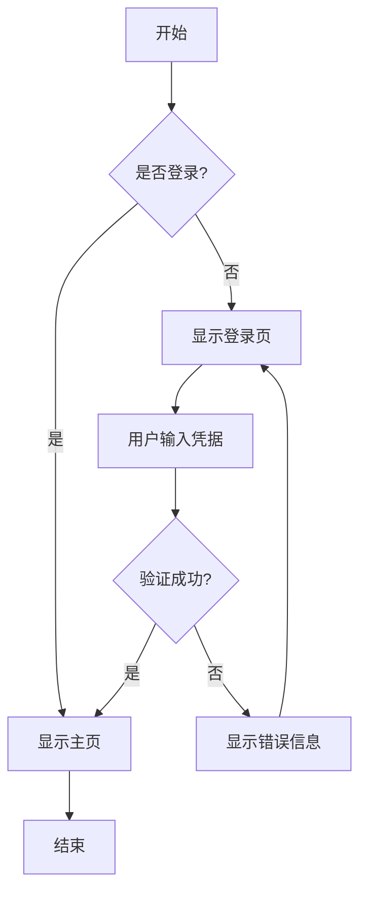
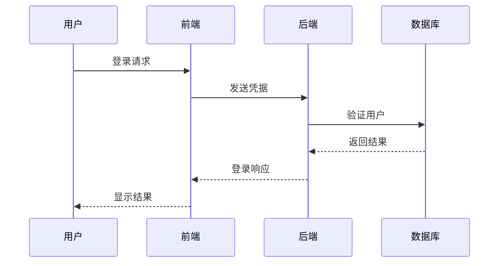
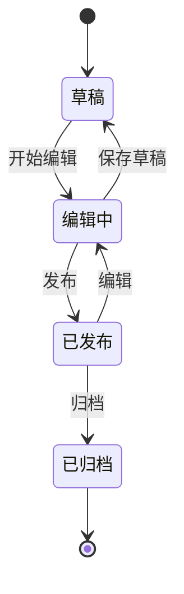
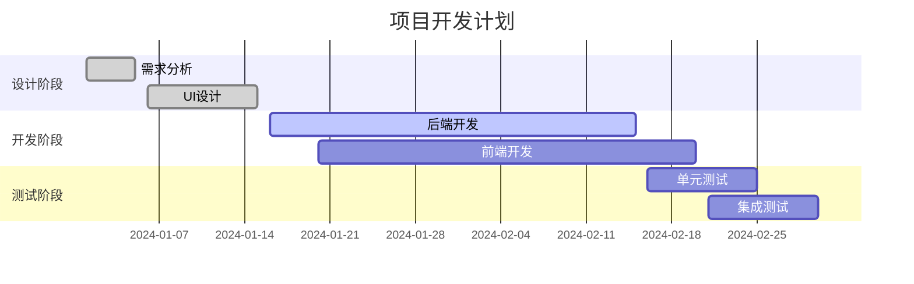
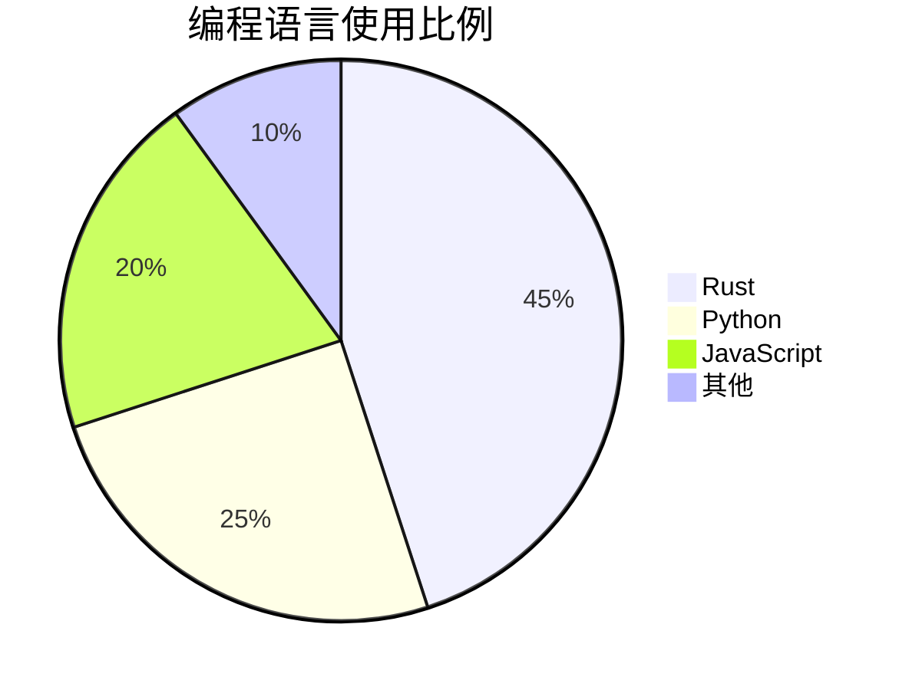
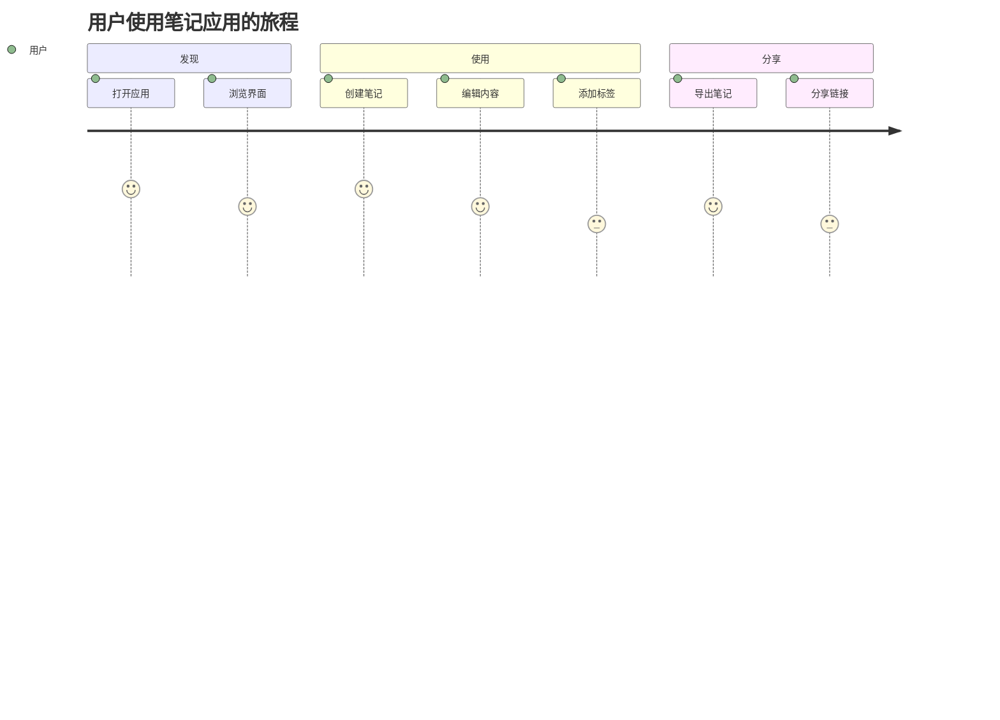
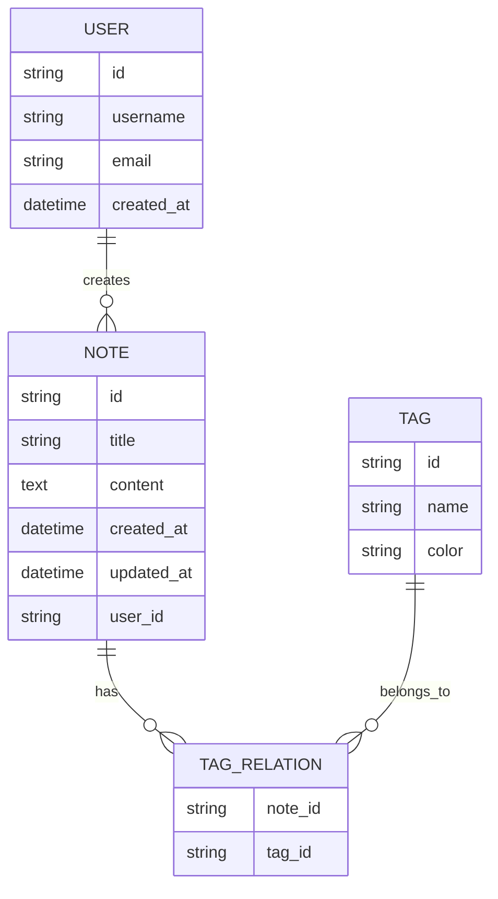

# Mermaid 图表测试

这是一个测试文档，用于验证我们的笔记系统是否支持Mermaid图表渲染。

## 流程图示例



## 时序图示例



## 类图示例

```mermaid
classDiagram
    class Note {
        +String id
        +String title
        +String content
        +DateTime created_at
        +DateTime updated_at
        +create()
        +update()
        +delete()
    }
    
    class Notebook {
        +String id
        +String name
        +String description
        +List~Note~ notes
        +addNote()
        +removeNote()
    }
    
    class Tag {
        +String id
        +String name
        +String color
    }
    
    Notebook ||--o{ Note : contains
    Note }o--o{ Tag : tagged_with
```

## 状态图示例



## 甘特图示例



## 饼图示例



## Git图示例

```mermaid
gitgraph
    commit
    commit
    branch develop
    checkout develop
    commit
    commit
    checkout main
    merge develop
    commit
    commit
```

## 用户旅程图示例



## 实体关系图示例



---

这些图表应该在笔记预览和幻灯片播放模式中都能正确显示。如果看到的是占位符图像而不是实际的Mermaid图表，说明我们的实现还需要进一步完善。
