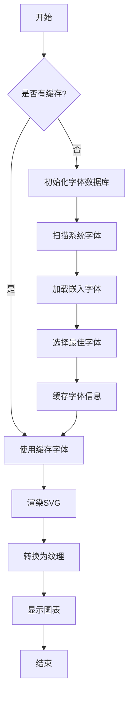
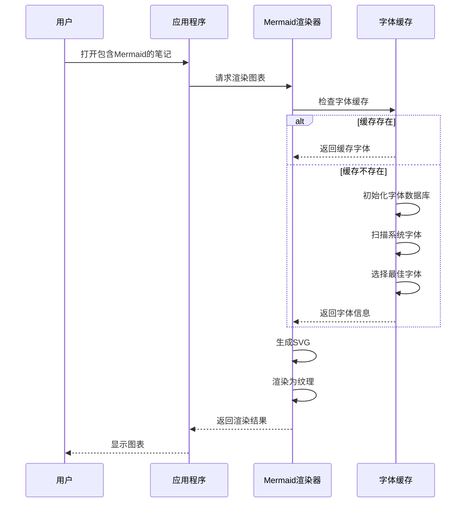
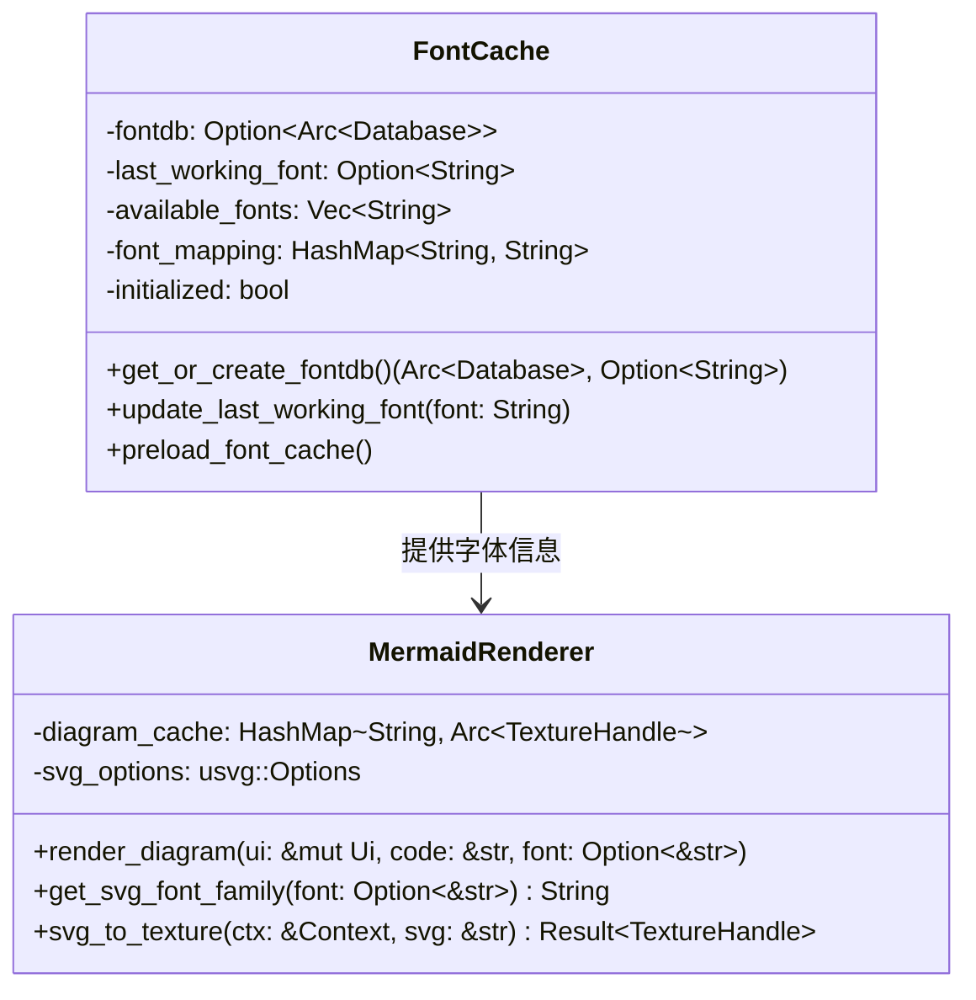
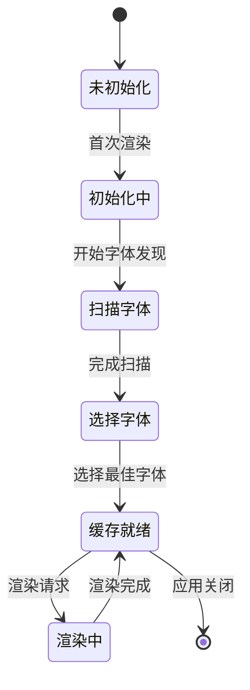
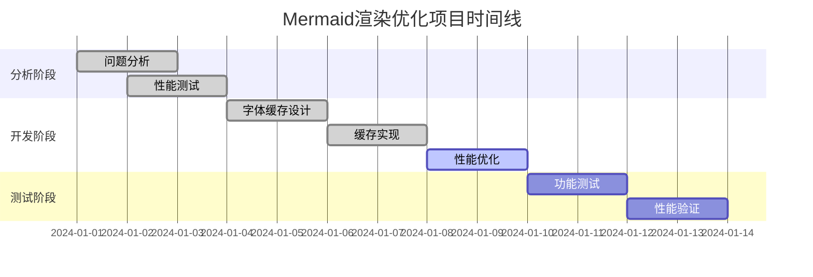
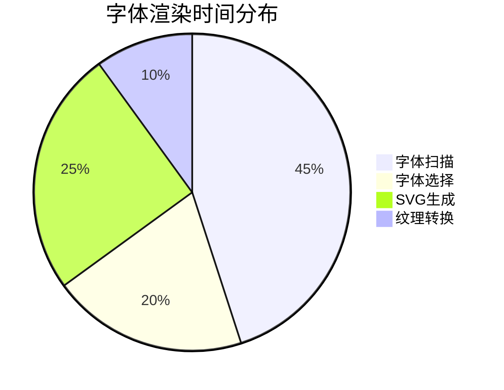

# Mermaid 渲染性能测试

这个文档用于测试Mermaid图表的渲染性能优化。

## 流程图测试

## 序列图测试

## 类图测试

## 状态图测试

## 甘特图测试

## 饼图测试

## 测试说明

1. **字体缓存优化**：通过全局缓存避免重复的字体数据库初始化
2. **字体映射**：建立应用设置到实际字体名称的映射关系
3. **预加载机制**：在应用启动时预加载字体缓存
4. **字体验证**：在初始化时验证字体的实际可用性
5. **智能回退**：使用经过验证的字体回退列表
6. **性能监控**：记录字体初始化和渲染时间

## 字体优化特性

### 字体验证机制
- 在字体选择时验证字体是否真正可用
- 避免选择无法正常渲染的字体
- 减少usvg字体回退警告

### 智能字体选择
- 优先选择Arial Unicode MS等广泛支持的字体
- 对每个候选字体进行实际渲染测试
- 建立基于实际可用性的字体回退列表

### 减少日志警告
- 通过字体验证减少"Fallback from X to Y"警告
- 选择经过验证的字体避免渲染问题
- 提供更清晰的字体选择日志

## 预期改进

- 首次渲染后，后续Mermaid图表渲染速度显著提升
- 减少字体扫描导致的UI卡顿
- 更好地利用应用程序的字体设置
- 提供更一致的字体渲染效果
- 显著减少字体回退警告日志
- 提高字体渲染的可靠性
