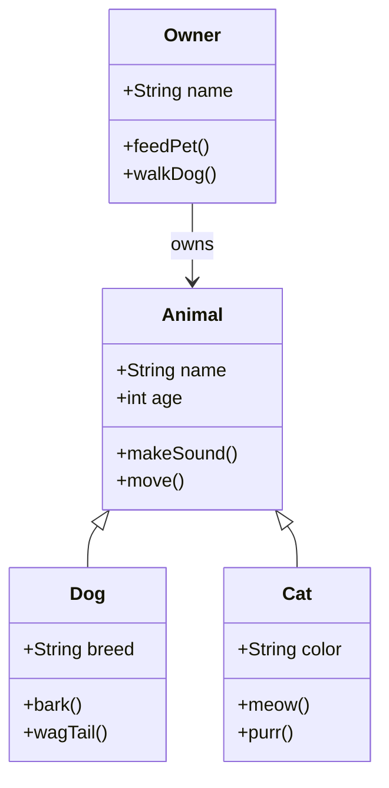
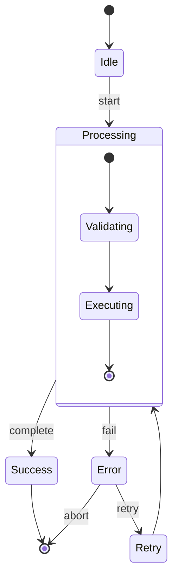
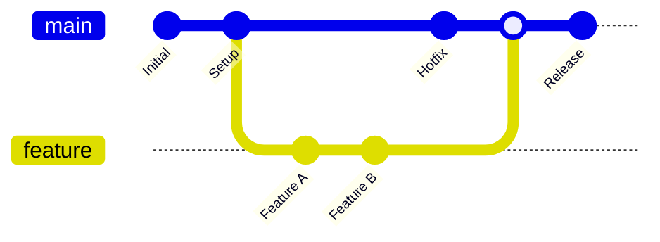
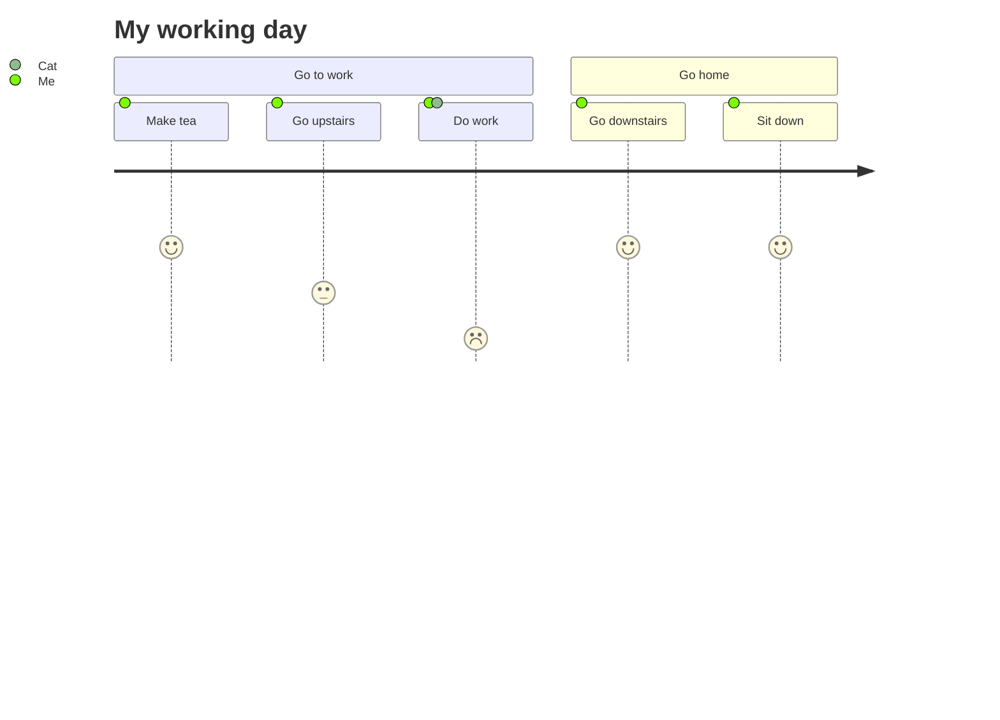
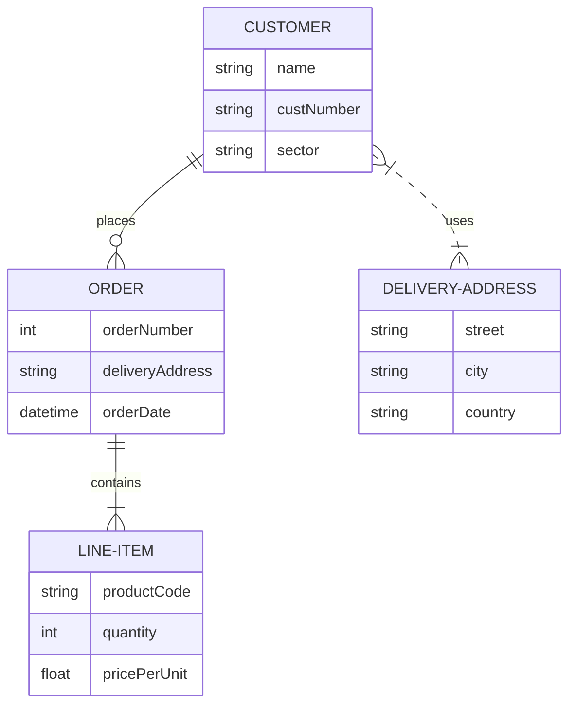

# 新增Mermaid图表类型测试

本文档用于测试新增的Mermaid图表类型支持。

## 1. 类图 (Class Diagram)

## 2. 状态图 (State Diagram)

## 3. Git图 (Git Graph)

## 4. 用户旅程图 (User Journey)

## 5. 实体关系图 (Entity Relationship Diagram)

## 测试说明

以上图表应该能够正确渲染，显示：
- 类图：显示类的结构和继承关系
- 状态图：显示状态转换和嵌套状态
- Git图：显示分支、合并和提交历史
- 用户旅程图：显示用户体验流程和满意度
- 实体关系图：显示数据库表结构和关系

如果图表无法正确渲染，应该显示相应的占位符和错误信息。
