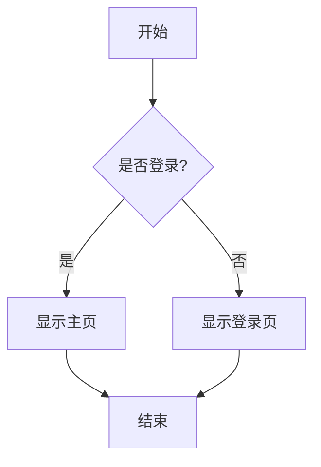
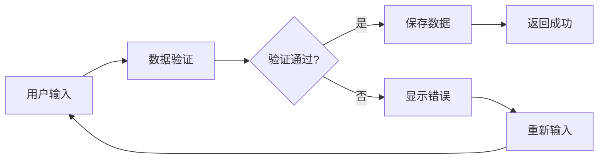

# SVG文字渲染测试

这个文档用于测试SVG图形和文字的渲染功能，使用与Mermaid相同的技术栈。

## 基础SVG测试

下面是一个简单的SVG测试，包含各种图形和文字：

```svg-test
这里的内容会被忽略，SVG测试渲染器会生成预定义的测试图形
```

## 更多SVG测试

让我们测试多个SVG渲染器实例：

```svgtest
另一个SVG测试实例
```

## Mermaid流程图测试

下面是一个简单的Mermaid流程图，用于对比文字渲染效果：



## 复杂Mermaid测试



## 测试说明

1. **SVG测试渲染器**：使用与Mermaid相同的技术栈（usvg + resvg + tiny-skia）
2. **字体加载**：加载系统字体和嵌入式字体（思源黑体、文泉驿微米黑）
3. **文字渲染**：测试中文、英文、数字、符号的渲染效果
4. **图形渲染**：测试矩形、圆形、菱形等基本图形

## 预期结果

- SVG测试应该显示包含文字的图形
- 文字应该清晰可见，不应该出现空白或乱码
- 中文字符应该正确显示
- 图形和文字的组合应该协调美观

## 故障排除

如果文字不显示，可能的原因：
1. 字体数据库未正确加载系统字体
2. SVG中的font-family属性与实际可用字体不匹配
3. usvg的文字转路径过程中出现问题
4. 字体文件路径不正确

## 技术细节

使用的技术栈：
- **usvg**: SVG解析和处理
- **resvg**: SVG渲染引擎
- **tiny-skia**: 2D图形渲染
- **fontdb**: 字体数据库管理
- **egui**: UI框架和纹理管理
